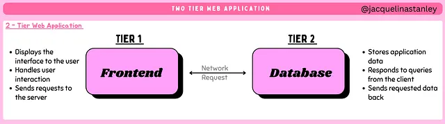
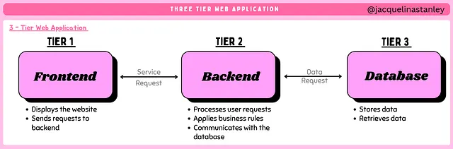

# Week 00 - Internet and Networking

Part of the DevOps Micro Internship (DMI) Cohort 3 with Agentic AI

---

# 🧑‍💻 Task 1: Using ChatGPT as Your Learning Assistant

## Scenario

You're new to DevOps and will frequently encounter technical questions. ChatGPT can be your learning companion.

## Your Task

Write a clear ChatGPT prompt to help you understand:

> "What is a protocol in networking? Explain with a simple real-life example."

Take a screenshot of your interaction showing:

- Your detailed prompt (with clear expectations)
- ChatGPT's simplified response with an example

## Screenshot

Save your screenshot in the `screenshots` folder and update the file name below.


---

## What I Learned (2–3 lines)

The biggest mistake people make with AI is assuming it automatically understands their problem. Think of ChatGPT as a technical co-pilot that accelerates learning and problem solving.

In reality, the quality of the answer depends on the quality of the prompt.

For DevOps engineers, using a structured prompt framework can dramatically improve the usefulness of AI responses when working with cloud infrastructure, CI/CD pipelines, automation, and troubleshooting.

When used correctly, ChatGPT becomes more than a chatbot.

It becomes a powerful engineering assistant.

---

# 🌐 Task 2: Internet and Networking

## Scenario

Your friend is launching an online bookstore named **EpicReads**.

He asked you to explain how users globally can access his website hosted in Finland.

## Your Task

Write a short explanation (**100–150 words**) that includes:

- Packet Switching
- IP Address
- TCP/IP
- HTTP/HTTPS

## Answer

To understand how DevOps engineers deploy and manage applications, you need to understand how the internet works.

When someone visits a website:

- The browser finds the server using its IP address, the server’s digital location.
- The request travels across networks using TCP/IP.
- Data is split into smaller pieces using packet switching so it can travel efficiently.
- The browser uses HTTP or HTTPS to request and display the website.

All of this happens within seconds whenever we browse the internet.

Read my full post here [Why DevOps Engineers Need to Understand Internet & Networking](https://medium.com/@jacquelinastanley/why-devops-engineers-need-to-understand-internet-networking-aa2a21c4de56?sharedUserId=jacquelinastanley)

---

# 🏗️ Task 3: Application Architecture & Stack

## Scenario

EpicReads bookstore has two application versions:

### Two-Tier Application

- Frontend
- Database

### Three-Tier Application

- Frontend
- Backend
- Database

## Your Task

- Draw simple diagrams (hand-drawn or tool-based such as draw.io)
- Label each layer clearly
- List at least two common technologies or tools used for each layer
- Submit a screenshot or photo clearly showing your own drawing

## Diagram Screenshot / Photo



Two-Tier Architecture
A two-tier application has only two layers:

Frontend — the interface users interact with
Database — where the data is stored
The frontend communicates directly with the database through a network request.



Three-Tier Architecture
A three-tier architecture adds another layer between the frontend and database.

The three layers are:

Frontend — what users see
Backend — processes requests and business logic
Database — stores the data
The frontend does not talk directly to the database. Instead, it sends requests to the backend.

---

## Technologies Used

### Frontend

- [React](https://react.dev/)
- [Streamlit](https://streamlit.io/)

### Backend

- [Python](https://www.python.org/)
- [Java](https://www.java.com/en/)

### Database

- [PostgreSQL](https://www.postgresql.org/)
- [DynamoDB](https://aws.amazon.com/dynamodb/?trk=5fa2d842-4ea7-471c-b68f-6855f38d19ae&sc_channel=ps&ef_id=Cj0KCQjwjIPSBhCCARIsABGyK7vvzP9Ujsi3vQRq1E0Ouagh5sFnX0BI1dIS7hpK68J5NOR_RrOHpM4aAkuSEALw_wcB&gads_camp=23523526545&gads_ag=195473573009&gads_ad=795924543284&gads_kw=dynamodb&gads_matchtype=e&gads_network=g&gads_device=c&gads_geo=9066777&gad_campaignid=23523526545&gbraid=0AAAAADjHtp-TIE12Mi3o--ggP3izrLvb0&gclid=Cj0KCQjwjIPSBhCCARIsABGyK7vvzP9Ujsi3vQRq1E0Ouagh5sFnX0BI1dIS7hpK68J5NOR_RrOHpM4aAkuSEALw_wcB)

---

# 🌍 Task 4: Domain Name & DNS (Basic Concepts)

## Scenario

Your friend's bookstore **EpicReads** is currently accessible through:

```text
52.172.142.222:3000
```

He purchased the domain:

```text
epicreads.com
```

## Your Task

In **50–100 words**, explain in your own words:

1. What is DNS (Domain Name System)?
2. Which DNS record type should be used to connect the domain to the given IP, and why?

## Answer

When users type google.com into their browser, the Domain Name System (DNS) converts the domain into an IP address so the correct server can be found.

Think of DNS as the internet’s phonebook.
Humans remember names like:
Google
But computers communicate using numbers like:
52.172.142.222

A DNS A Record connects a domain name directly to a server’s IPv4 address so users can access websites without remembering numeric IPs.

---

# 💻 Task 5: Visual Studio Code Setup (Hands-on)

## Your Task

Install Visual Studio Code (if not already installed).

Take a screenshot of your VS Code environment showing:

- Terminal open inside VS Code
- Running a basic command:

### Windows

```powershell
dir
```

### Linux / macOS

```bash
pwd
ls
```

- Your selected VS Code theme clearly visible

⚠️ **Important:** The screenshot must show your username or another identifiable detail to confirm it is your environment.

## Screenshot

Save your screenshot in the `screenshots` folder and update the file name below.


---

# 🔗 Task 6: Publish Your Assignment as a LinkedIn Post

## Objective

Publishing on LinkedIn helps you:

- Build your professional online presence
- Reinforce your learning
- Document your DevOps journey publicly

## Your Task

Summarize your answers from Tasks 1–5 into a LinkedIn post.

Clearly structure your post into the following sections:

- ChatGPT
- Internet & Networking
- App Architecture
- DNS
- VS Code Setup

Add the following credit note at the end of your post:

> **P.S. This post is a part of DevOps Micro Internship with Agentic AI Cohort-3 by Pravin Mishra. You can start your DevOps journey by joining this Discord community: https://discord.pravinmishra.com/**

---

## LinkedIn Post URL

Paste your LinkedIn post URL here:

[LinkedIn Post](https://www.linkedin.com/posts/jacquelinastanley_devops-basics-activity-7439312610807771136-QPdj?utm_source=share&utm_medium=member_desktop&rcm=ACoAACqgUDgBkc_3b0ArkGRFdG2zpRLpgXmzwTo)

---

## LinkedIn Post Backup Copy

Paste the full text of your LinkedIn post here:

Do You Know These DevOps Basics? ☁️⚙️

I recently completed a DevOps basics micro-internship task, and it reminded me that before learning advanced DevOps tools, you must first understand the fundamentals.

Here are a few key things I learned.

1️⃣ ChatGPT as a Learning Assistant
ChatGPT can be a powerful learning tool when used correctly.
Instead of asking vague questions, structuring prompts clearly helps you get better answers.
The key lesson: good prompts lead to better answers.

2️⃣ Internet & Networking
To understand how DevOps engineers deploy and manage applications, you need to understand how the internet works.
When someone visits a website:
- The browser finds the server using its IP address, the server’s digital location.
- The request travels across networks using TCP/IP.
- Data is split into smaller pieces using packet switching so it can travel efficiently.
- The browser uses HTTP or HTTPS to request and display the website.
All of this happens within seconds whenever we browse the internet.

3️⃣ Application Architecture
Another important concept is application architecture, especially the difference between two-tier and three-tier architectures.
Two-tier architecture:
Frontend → Database
Three-tier architecture:
Frontend → Backend → Database
Understanding this helps DevOps engineers deploy the right infrastructure, scale applications, and troubleshoot systems more effectively.

4️⃣ Domain Name & DNS
When users type google.com into their browser, the Domain Name System (DNS) converts the domain into an IP address so the correct server can be found.

Think of DNS as the internet’s phonebook.
Humans remember names like:
Google
But computers communicate using numbers like:
52.172.142.222

A DNS A Record connects a domain name directly to a server’s IPv4 address so users can access websites without remembering numeric IPs.

5️⃣ Visual Studio Code Setup
Another essential tool for DevOps engineers is Visual Studio Code (VS Code).
VS Code is a lightweight but powerful editor used to write scripts, edit configuration files, and manage projects.

Tools like VS Code help engineers write, manage, and automate the code that runs modern cloud infrastructure and applications.

Becoming a DevOps engineer can feel overwhelming at first, but mastering the fundamentals makes everything easier.

If you are also learning DevOps, feel free to connect with me. 🚀
P.S. This post is part of the FREE DevOps Micro Internship Cohort run by Pravin Mishra.

You can start your DevOps journey here:
 https://lnkd.in/gYm_ghfe 

 hashtag#DevOps
 hashtag#CloudComputing
 hashtag#Networking
 hashtag#DNS
 hashtag#LearningInPublic

# Reflection – Week 0

### What did you find easy?

I found it easy to understand the task and get started because the instructions were clear.

---

### What was difficult?

What I found difficult was managing the new parts of the task and making sure I did everything correctly.

---

### What will you improve next week?

Next week, I will improve by planning my work earlier, checking my progress more carefully, and asking questions sooner if I am unsure.

---

## 📌 About DMI & CloudAdvisory

DevOps Micro Internship (DMI) is a project-based DevOps program run by Pravin Mishra (The CloudAdvisory) focused on real-world execution, systems thinking, and career readiness.

It helps learners build strong DevOps foundations with hands-on experience.

## 📌 Resources

- 🌐 **DMI Official Website:** https://pravinmishra.com/dmi
- 🎓 **DevOps for Beginners (Udemy):** https://www.udemy.com/course/devops-for-beginners-docker-k8s-cloud-cicd-4-projects/
- 🎓 **Ultimate Agentic AI DevOps with Clude Code** https://www.udemy.com/course/ultimate-agentic-ai-devops-with-claude-code/?referralCode=448389767BC96284087B
- 🎓 **DevOps with Claude Code: Terraform, EKS, ArgoCD & Helm** https://www.udemy.com/course/devops-with-claude-code-terraform-eks-argocd-helm/?referralCode=1C5B734505D65A010FA3
- ▶️ **YouTube Playlist (DMI Cohort 3):** https://www.youtube.com/playlist?list=PLFeSNDtI4Cho
- 🔗 **Pravin Mishra (LinkedIn):** https://www.linkedin.com/in/pravin-mishra-aws-trainer/
- 🏢 **CloudAdvisory (LinkedIn):** https://www.linkedin.com/company/thecloudadvisory/

---

_This submission is part of DevOps Micro Internship (DMI) Cohort 3 — Agentic AI Track_
