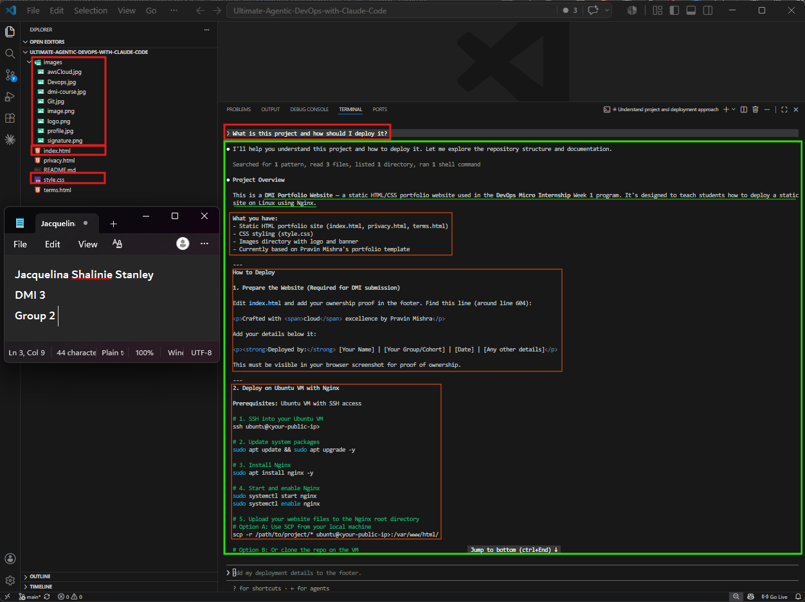
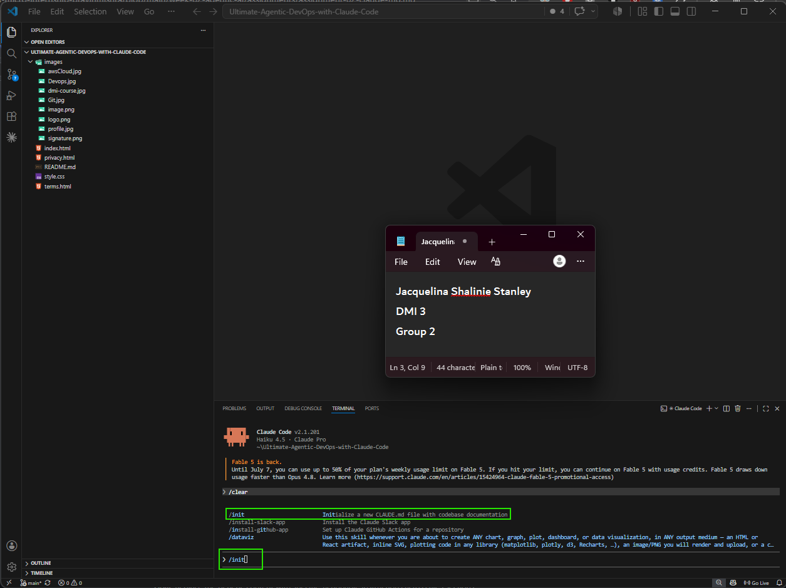
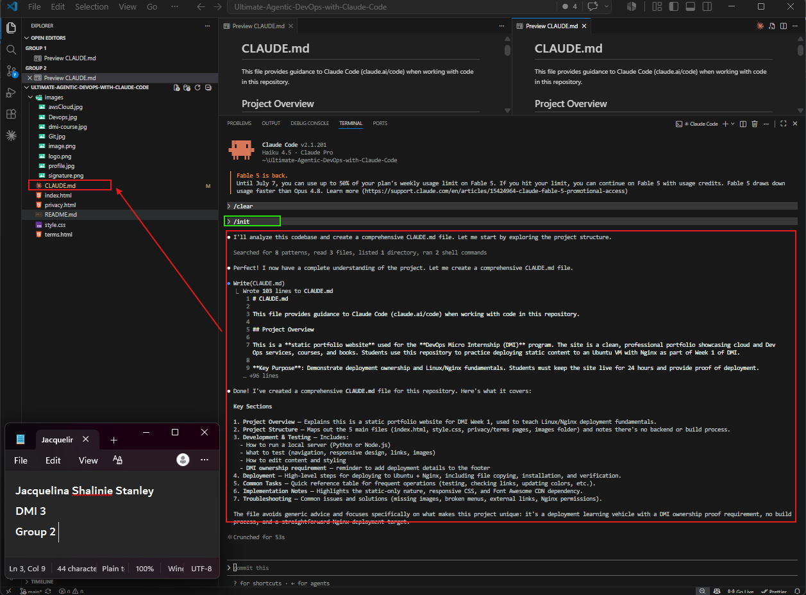
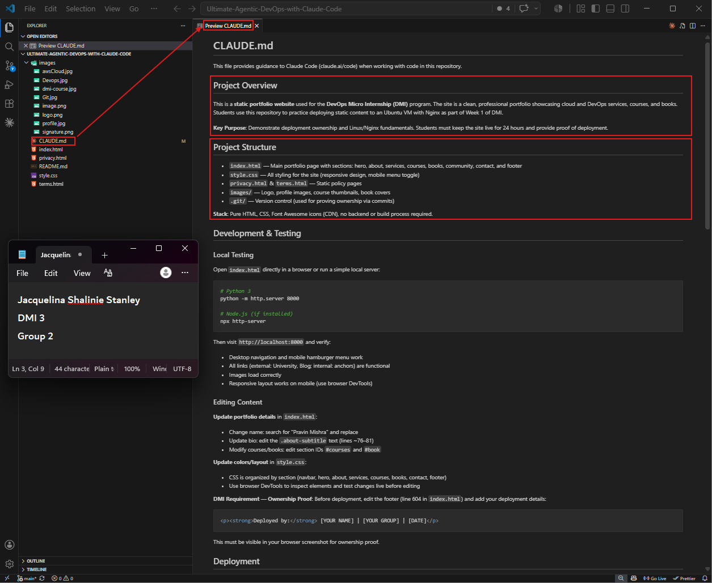
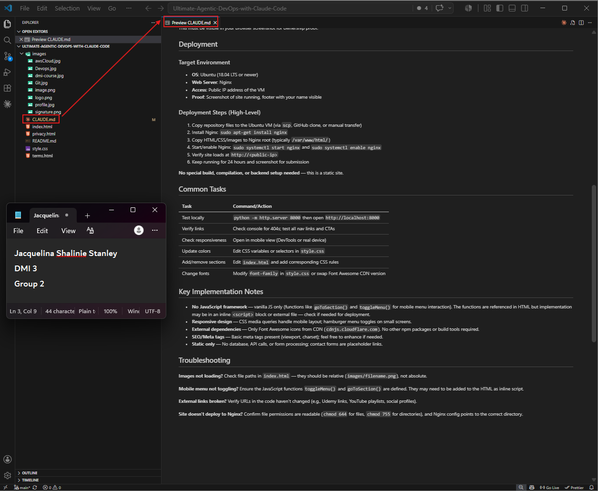
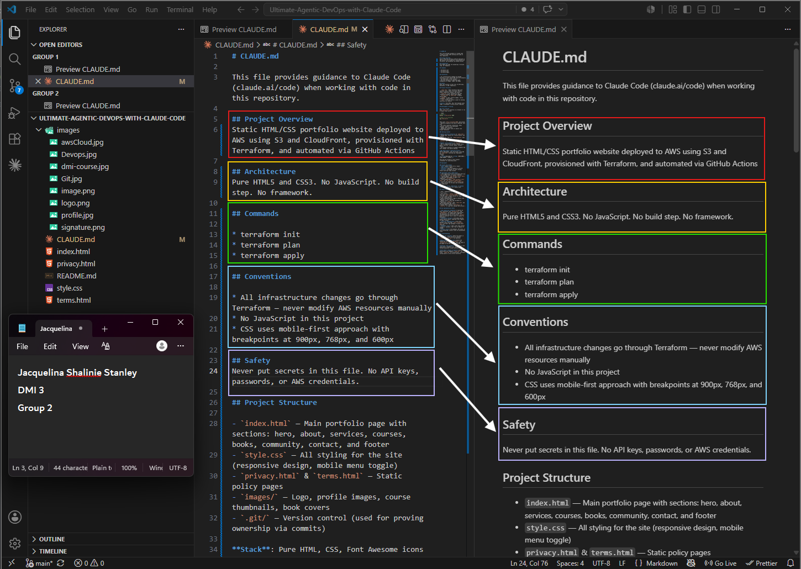
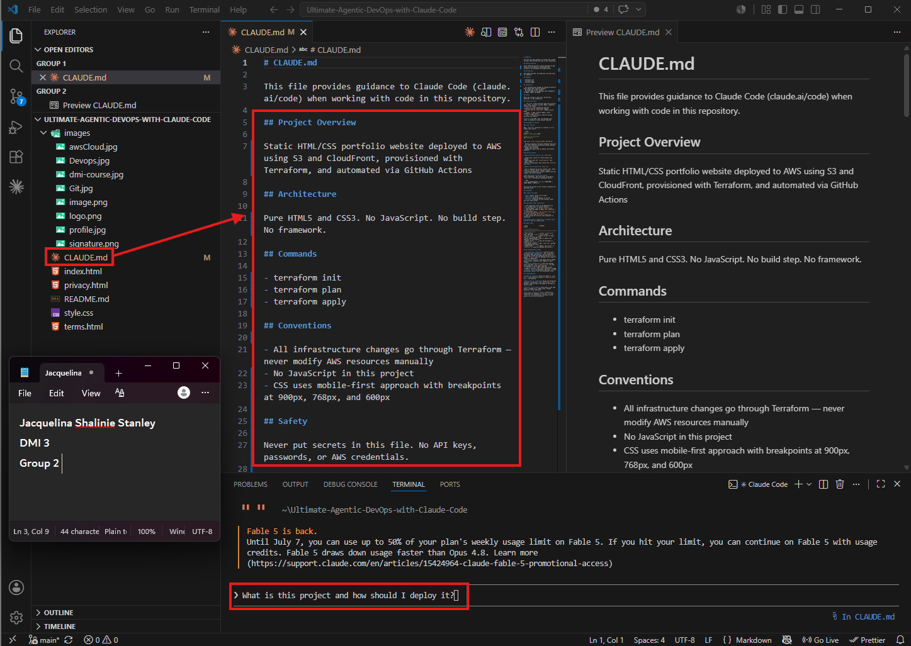
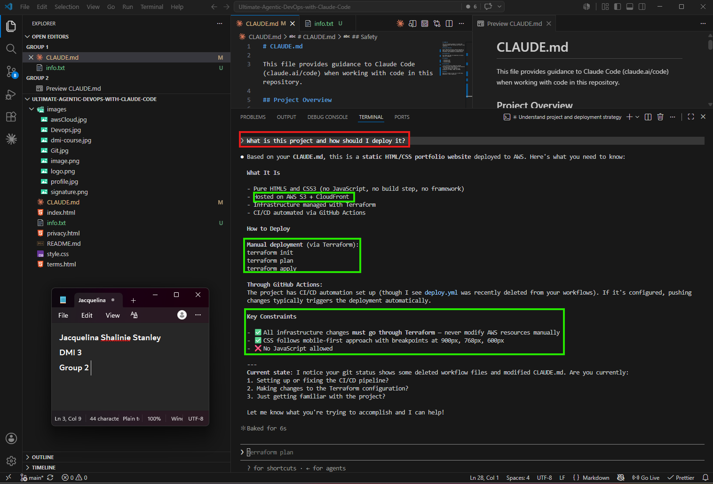
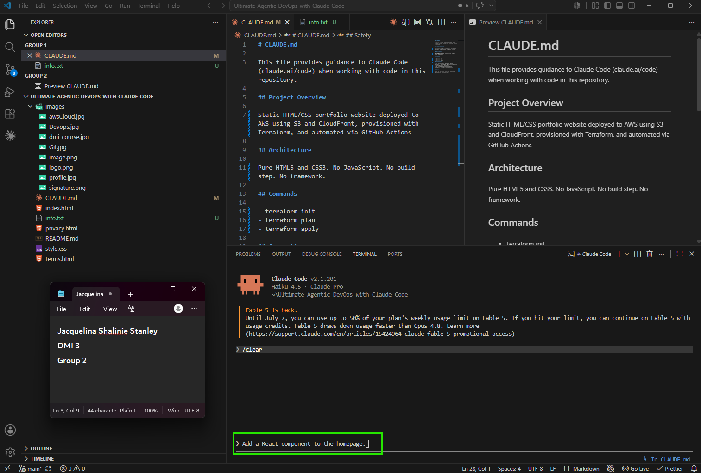
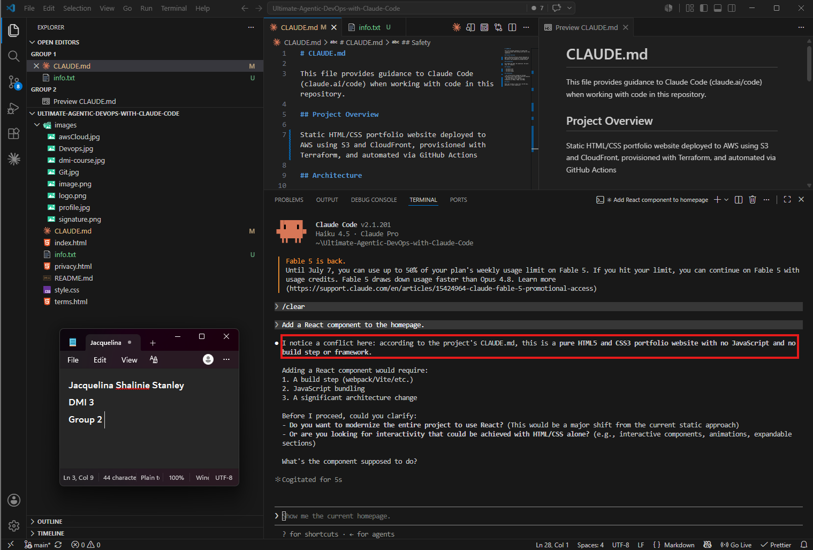

# Assignment 2 — Teaching Claude Your Project

Part of the DevOps Micro Internship (DMI) Cohort 3 with Agentic AI

---

## Purpose

In this assignment, you will create and customize a `CLAUDE.md` file for your project using `/init`. You will then modify it with project-specific rules and verify how it changes Claude’s behavior through before-and-after testing.

---

# Task 1 — Capture the Before State

## Goal

Capture Claude’s response before `CLAUDE.md` exists in the project to establish a baseline behavior.

### Evidence

#### Screenshot 1 — Claude response before CLAUDE.md

---

# Task 2 — Generate the First Draft with /init

## Goal

Generate an initial `CLAUDE.md` file using the `/init` command and review the auto-generated content.

### Evidence

#### Screenshot 2 — Auto-generated CLAUDE.md

---

# Task 3 — Customize the CLAUDE.md

## Goal

Update the generated `CLAUDE.md` file by adding project-specific instructions across all required sections.

### Evidence

#### Screenshot 3 — Customized CLAUDE.md (all 5 sections visible)

---

# Task 4 — Test the After State

## Goal

Verify that Claude’s behavior changes after adding `CLAUDE.md` by running a new session and comparing responses before and after context is applied.

### Evidence

#### Screenshot 4 — Claude response with project-specific deployment details

---

#### Screenshot 5 — Claude response rejecting React/component change based on rules

---

# Submission Instructions

- Ensure `CLAUDE.md` is committed to your GitHub repository
- Add all required screenshots to your submission
- Push your final changes to your forked repository

---

## GitHub Repository URL

Paste your forked repository URL here:

`https://github.com/jacquelinastanley/Ultimate-Agentic-DevOps-with-Claude-Code`

---

# Completion Checklist

- [✅] Screenshot 1 shows Claude’s generic response (before CLAUDE.md)
- [✅] Screenshot 2 shows `/init` generated CLAUDE.md
- [✅] Screenshot 3 shows fully customized CLAUDE.md with all 5 sections
- [✅] Screenshot 4 shows updated deployment-aware Claude response
- [✅] Screenshot 5 shows Claude rejecting React request based on rules
- [✅] CLAUDE.md is committed and visible in GitHub repository

---

## 📌 About DMI & CloudAdvisory

DevOps Micro Internship (DMI) is a project-based DevOps program run by Pravin Mishra (The CloudAdvisory) focused on real-world execution, systems thinking, and career readiness.

It helps learners build strong DevOps foundations with hands-on experience.

---

## 📌 Resources

- 🌐 DMI Official Website: https://pravinmishra.com/dmi  
- 🎓 DevOps for Beginners (Udemy): https://www.udemy.com/course/devops-for-beginners-docker-k8s-cloud-cicd-4-projects/  
- 🎓 Agentic AI DevOps with Claude Code: https://www.udemy.com/course/ultimate-agentic-ai-devops-with-claude-code/  
- 🎓 DevOps with Claude Code: Terraform, EKS, ArgoCD & Helm: https://www.udemy.com/course/devops-with-claude-code-terraform-eks-argocd-helm/  
- ▶️ YouTube Playlist: https://www.youtube.com/playlist?list=PLFeSNDtI4Cho  
- 🔗 Pravin Mishra (LinkedIn): https://www.linkedin.com/in/pravin-mishra-aws-trainer/  
- 🏢 CloudAdvisory (LinkedIn): https://www.linkedin.com/company/thecloudadvisory/

---

*This submission is part of DevOps Micro Internship (DMI) Cohort 3 — Agentic AI Track.*