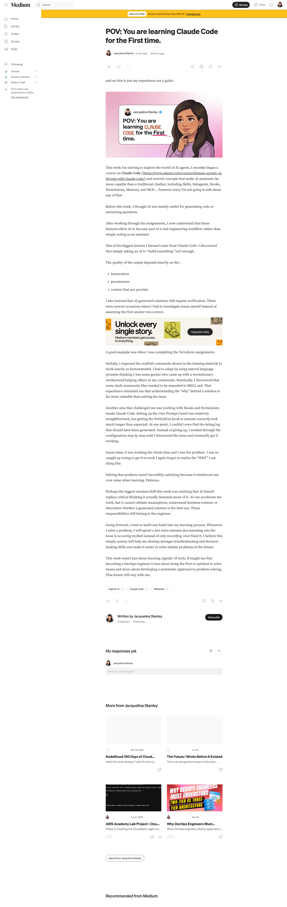
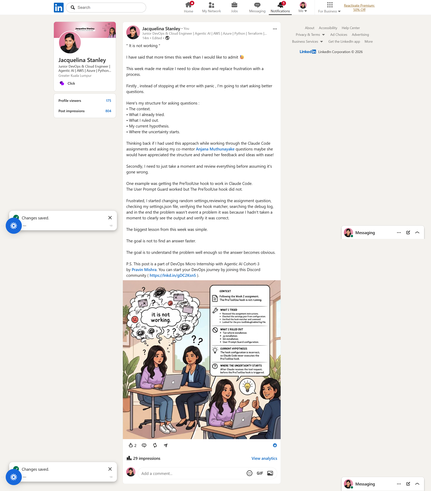

# Assignment 8 — Week 2 Reflection Blog

Part of the DevOps Micro Internship (DMI) Cohort 3 with Agentic AI

---

# Purpose

In this assignment, you will reflect on your Week 2 learning journey and write a short blog capturing your experience working with Agentic AI tools such as Claude Code, Skills, Subagents, MCP, Hooks, Permissions, and Memory.

You will also publish a LinkedIn post summarizing your learning and share both links for evaluation.

---

# Task 1 — Write Your Reflection Blog

## Goal

Write a reflection blog covering your Week 2 learning experience.

### Blog Requirements

Your blog must include:

* Title: **Reflection – Week 2**
* Minimum 300 words
* At least 2–3 topics from Week 2 (Claude Code, Skills, Subagents, MCP, Hooks, Permissions, Memory)
* Honest personal reflection (learning, challenges, mindset)
* One habit/system you plan to implement
* Your full name clearly visible

### Allowed Platforms

You can publish your blog on:

* Hashnode
* Medium
* Dev.to
* LinkedIn Article
* GitHub Markdown file
* Substack

---

### Evidence

#### Screenshot 1 — Blog published and visible



---

### Submission Field

Blog Link:

`https://medium.com/@jacquelinastanley/pov-you-are-learning-claude-code-for-the-first-time-0c15b63ea2ac?sharedUserId=jacquelinastanley`

---

# Task 2 — Create LinkedIn Post

## Goal

Share your Week 2 learning publicly on LinkedIn.

---

### LinkedIn Post Requirements

Your post must include:

* One screenshot from any Week 2 assignment
* Short reflection (what you learned or built)
* Required P.S. line exactly as given below

---

### Required P.S. Line (Must Include Exactly)

P.S. This post is a part of DevOps Micro Internship with Agentic AI Cohort-3 by Pravin Mishra. You can start your DevOps journey by joining this Discord community ( [https://discord.pravinmishra.com/](https://discord.pravinmishra.com/) ).

---

### Suggested Hashtags

#DMIByPravinMishra #AgenticAI #ClaudeCode #DevOps #LearningInPublic

---

### Evidence

#### Screenshot 2 — LinkedIn post published



---

### Submission Field

LinkedIn Post Content (copy-paste here):

```
" It is not working "

I have said that more times this week than I would like to admit 😓 

This week made me realize I need to slow down and replace frustration with a process.

Firstly , instead of stopping at the error with panic , I'm going to start asking better questions.

Here's my structure for asking questions :
• The context.
• What I already tried.
• What I ruled out.
• My current hypothesis.
• Where the uncertainty starts.

Thinking back if I had used this approach while working through the Claude Code assignments and asking my co-mentor Anjana Muthunayake questions maybe she would have appreciated the structure and shared her feedback and ideas with ease! 

Secondly, I need to just take a moment and review everything before assuming it's gone wrong. 

One example was getting the PreToolUse hook to work in Claude Code.
The User Prompt Guard worked but The PreToolUse hook did not.

Frustrated, I started changing random settings,reviewing the assignment question, checking my settings.json file, verifying the hook matcher, searching the debug log, and in the end the problem wasn't event a problem it was because I hadn't taken a moment to clearly see the output and verify it was correct. 

The biggest lesson from this week was simple.

The goal is not to find an answer faster.

The goal is to understand the problem well enough so the answer becomes obvious.

P.S. This post is a part of DevOps Micro Internship with Agentic AI Cohort-3 by Pravin Mishra. You can start your DevOps journey by joining this Discord community ( https://lnkd.in/gDC2Ksn5 ).
```

---

### LinkedIn Post Link:

`https://www.linkedin.com/posts/jacquelinastanley_it-is-not-working-i-have-said-that-more-share-7481384957995569153-VtCj/?utm_source=share&utm_medium=member_desktop&rcm=ACoAACqgUDgBkc_3b0ArkGRFdG2zpRLpgXmzwTo`

I also posted about subagents 

`https://www.linkedin.com/posts/jacquelinastanley_mastering-subagents-ugcPost-7480646263177236480-L4Tf/?utm_source=share&utm_medium=member_desktop&rcm=ACoAACqgUDgBkc_3b0ArkGRFdG2zpRLpgXmzwTo`

---

# Submission Instructions

* Blog must be publicly accessible
* LinkedIn post must be visible (public or unlisted where applicable)
* All required fields must be filled
* Screenshot proofs must be added to GitHub repository
* Do not include sensitive information in blog or post

---

# Completion Checklist

* [✅] Blog written with required structure
* [✅] Blog includes at least 2–3 Week 2 topics
* [✅] Blog is publicly accessible
* [✅] LinkedIn post created
* [✅] Required P.S. line included
* [✅] LinkedIn post content copied in submission field
* [✅] Blog link added
* [✅] LinkedIn post link added
* [✅] Screenshots added to GitHub repo

---

# About DMI & CloudAdvisory

DevOps Micro Internship (DMI) is a project-based DevOps program run by Pravin Mishra (The CloudAdvisory), focused on real-world execution, systems thinking, and agentic AI workflows.

It helps learners build strong DevOps foundations through hands-on experience.

---

# Resources

* 🌐 DMI Official Website: [https://pravinmishra.com/dmi](https://pravinmishra.com/dmi)
* 🎓 DevOps for Beginners (Udemy): [https://www.udemy.com/course/devops-for-beginners-docker-k8s-cloud-cicd-4-projects/](https://www.udemy.com/course/devops-for-beginners-docker-k8s-cloud-cicd-4-projects/)
* 🎓 Agentic AI DevOps with Claude Code: [https://www.udemy.com/course/ultimate-agentic-ai-devops-with-claude-code/](https://www.udemy.com/course/ultimate-agentic-ai-devops-with-claude-code/)
* 🎓 DevOps with Claude Code: Terraform, EKS, ArgoCD & Helm: [https://www.udemy.com/course/devops-with-claude-code-terraform-eks-argocd-helm/](https://www.udemy.com/course/devops-with-claude-code-terraform-eks-argocd-helm/)
* ▶️ YouTube Playlist: [https://www.youtube.com/playlist?list=PLFeSNDtI4Cho](https://www.youtube.com/playlist?list=PLFeSNDtI4Cho)
* 🔗 Pravin Mishra (LinkedIn): [https://www.linkedin.com/in/pravin-mishra-aws-trainer/](https://www.linkedin.com/in/pravin-mishra-aws-trainer/)
* 🏢 CloudAdvisory (LinkedIn): [https://www.linkedin.com/company/thecloudadvisory/](https://www.linkedin.com/company/thecloudadvisory/)

