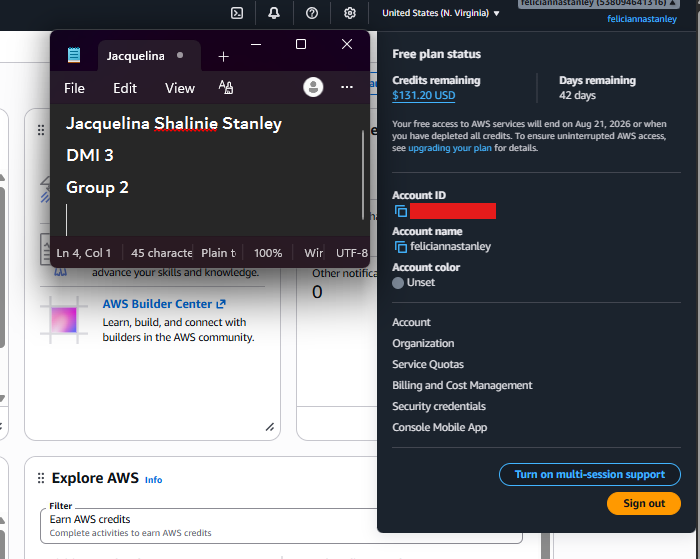

# Assignment 1 — AWS Free Tier Account Setup (EpicReads Cloud Onboarding)

Part of the DevOps Micro Internship (DMI) Cohort 3 with Agentic AI

---

## Purpose

In this assignment, you will create and verify an AWS Free Tier account as part of onboarding EpicReads — an online bookstore moving to the cloud. You will demonstrate an understanding of AWS fundamentals, Free Tier services, and account setup by answering conceptual questions and capturing proof of a working AWS Console login.

---

# Task 1 — Understanding AWS & Free Tier

## Goal

Demonstrate understanding of AWS basics and Free Tier usage by answering the following questions in your own words (3–4 lines each).

### Answers

#### Question 1 — What is an AWS account, and why do you need it at this stage?

An **AWS account** is your unique identity and secure digital workspace within Amazon's data centers. It functions as a locked container for your cloud resources such as virtual servers, databases, EC2 instances, and S3 buckets while managing your billing, tracking your usage, and controlling who is allowed access. You can think of it like renting an apartment in a giant building. You need your own key to bring in your belongings and lock the door to keep your space secure.

At this stage of learning, **having an AWS account is essential because it is the starting point for building anything in the cloud**. While tutorials and documentation provide foundational knowledge, they cannot replace the hands-on experience gained from working directly with real cloud infrastructure—the exact same environments used in actual DevOps roles. 

Specifically, you need an AWS account right now for a few main reasons:

*   **To Get Your Keys:** Creating an account gives you the login credentials (username and password) needed to access the AWS Management Console, allowing you to provision and manage your cloud tools.
*   **To Access Free Tools:** A new account unlocks the AWS Free Tier, which allows you to build real-world skills at little to no cost. This means you can practice deploying websites, provisioning virtual machines, and configuring databases without immediate billing concerns.
*   **To Set Rules and Security:** You need the account to configure AWS Identity and Access Management (IAM), which acts like a bouncer to ensure only authorized people or programs can access your data.

---

#### Question 2 —  What is AWS Free Tier, and how long does it last?

The AWS Free Tier is a program designed to let users—such as beginners, students, developers, and startups—explore, learn, and experiment with AWS cloud services at little to no cost

It gives you the opportunity to build real-world solutions without immediate billing concerns, provided your usage stays within defined limits

How long the Free Tier lasts depends on the specific type of offer you are using:

- 6-Month Free Plans / Credits: For accounts created after July 15, 2025, AWS provides a Free Plan that includes up to 200 i ncredits(100 at signup and up to $100 earned through guided activities)

  
  This plan lasts for up to six months or until your credits are exhausted, whichever comes first
  
  Once the credits run out or the 6-month period ends, the account closes automatically to protect you from surprise bills, though you are given a 90-day grace period to recover your data or upgrade to a paid plan
  

- Always Free: Some services have usage limits that remain free indefinitely
  
  For example, you can process 1,000,000 Lambda requests per month or use 25 GB of DynamoDB storage for free, and these limits never expire.

---

#### Question 3 — Name three AWS Free Tier services and their free usage limits.

**Amazon DynamoDB** is a database service that acts as a fast digital filing cabinet, offering a free limit of **25 GB of storage and 2.5 million stream read requests per month**. 

**AWS Lambda** is a service that runs your code without the need to provision or manage servers, and it provides a limit of **1 million free requests per month**. 

**Amazon SNS (Simple Notification Service)** is an automated messaging and alert service that includes a limit of **1 million free publishes per month**.

These three offerings fall under the "Always Free" category, meaning these specific usage limits **do not expire**. To ensure you do not exceed these limits, you can monitor your ongoing usage at any time by checking the **AWS Billing and Cost Management Console**.

---

# Task 2 — Create AWS Free Tier Account

## Goal

Create a valid AWS Free Tier account and sign in to the AWS Management Console.

> No screenshots required for this task. Completion is verified through Task 3.

---

# Task 3 — Verify AWS Account

## Goal

Confirm that your AWS account setup is complete by navigating to the Account section and capturing proof.

### Evidence

#### Screenshot 1 — AWS Account page showing account name (email may be blurred)

---

# Submission Instructions

- Add all required screenshots in your GitHub repository submission
- Full name must be visible in required screenshots
- Do not expose sensitive information (keys, passwords, account IDs)

---

# Completion Checklist

- [✅] Task 1 answers written in own words
- [✅] AWS Free Tier account created successfully
- [✅] Signed in to AWS Management Console
- [✅] Screenshot of AWS Account page captured (full name visible, no sensitive data)
- [✅] All required screenshots added to repository

---

## 📌 About DMI & CloudAdvisory

DevOps Micro Internship (DMI) is a project-based DevOps program run by Pravin Mishra (The CloudAdvisory) focused on real-world execution, systems thinking, and career readiness.

It helps learners build strong DevOps foundations with hands-on experience.

---

## 📌 Resources

- 🌐 DMI Official Website: https://dmi.pravinmishra.com?utm_source=github&utm_medium=readme  
- 🎓 University: https://university.pravinmishra.com?utm_source=github&utm_medium=readme  
- 💬 Discord Community: https://discord.pravinmishra.com?utm_source=github&utm_medium=readme  
- 📝 Blog: https://dmi.pravinmishra.com/blog?utm_source=github&utm_medium=readme  
- ▶️ YouTube Playlist: https://www.youtube.com/playlist?list=PLFeSNDtI4Cho  
- 🔗 Pravin Mishra (LinkedIn): https://www.linkedin.com/in/pravin-mishra-aws-trainer/  
- 🏢 CloudAdvisory (LinkedIn): https://www.linkedin.com/company/thecloudadvisory/

---

*This submission is part of DevOps Micro Internship (DMI) Cohort 3 — Agentic AI Track.*