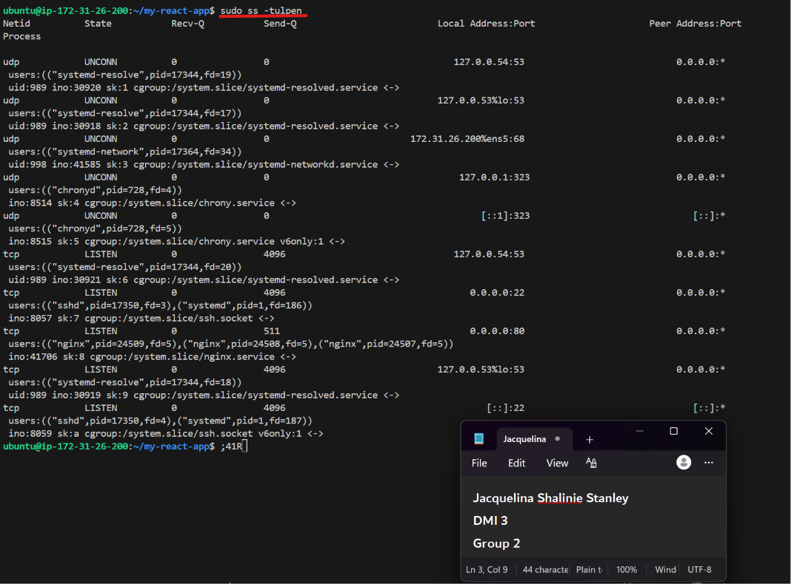
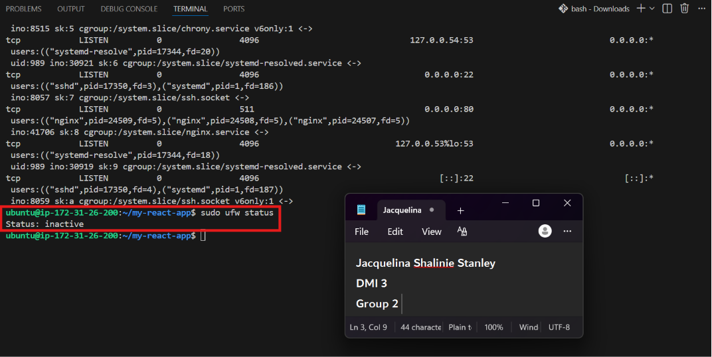
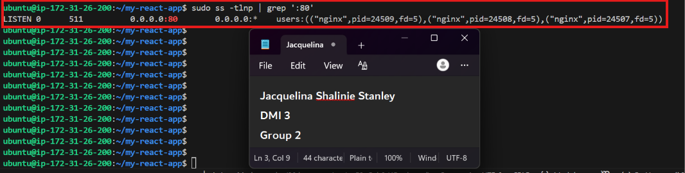
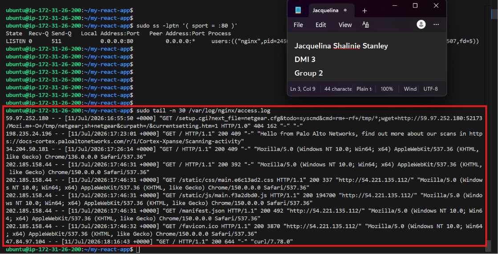
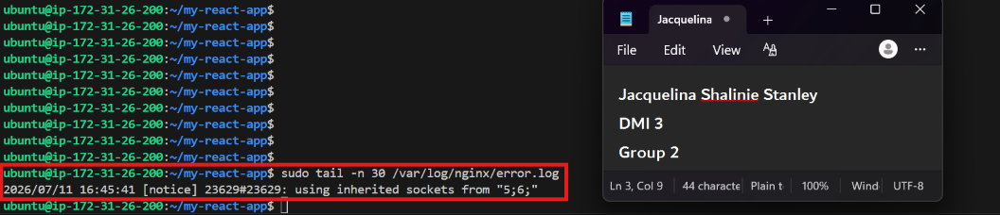
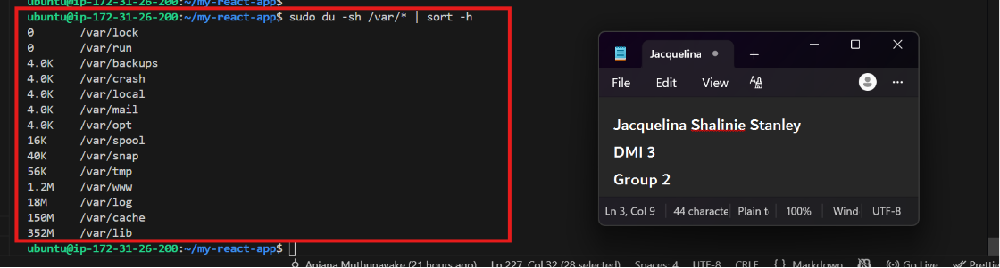
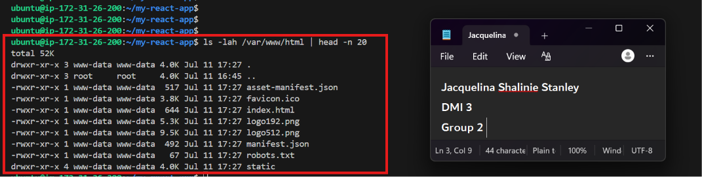
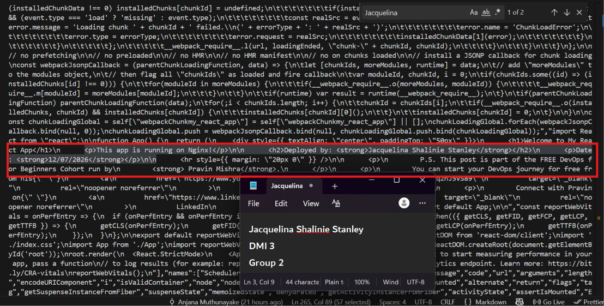
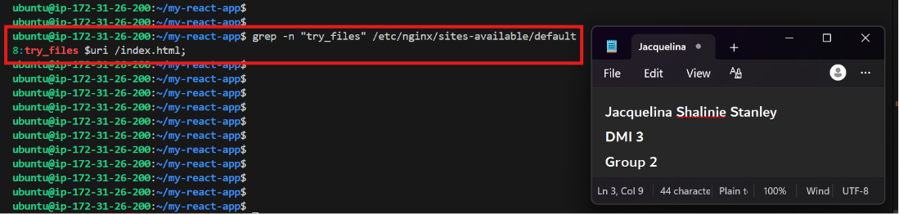
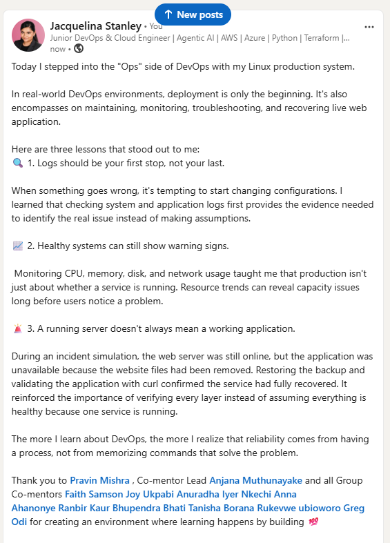

# Assignment 3 — Production Maintenance Drill (OPS Checklist)

Part of the DevOps Micro Internship (DMI) Cohort 3 with Agentic AI

---

## Purpose

In this assignment, you will treat your already deployed React application (on Ubuntu VM with Nginx) as a live production system. You will perform structured operational checks covering network validation, service health, log analysis, resource monitoring, configuration verification, and incident simulation with recovery — mirroring real on-call DevOps responsibilities.

---

# Task 1 — Server Access & Networking Validation

## Goal

Verify that the deployed React application is reachable from the browser and confirm basic network connectivity of the Ubuntu VM.

### Evidence

#### Screenshot 1 — Browser showing the React app with your Full Name visible on the UI


---

#### Screenshot 2 — Output of `ip a`


---

#### Screenshot 3 — Output of `sudo ss -tulpen`



---

#### Screenshot 4 — Output of `sudo ufw status`




---

### Notes

Answer the following in your own words:

**1. What proves Nginx is listening on 0.0.0.0:80?**

In the sudo ss -tulpen output, the important proof is a line showing Nginx bound to port 80 with a listening socket on 0.0.0.0:80 or *:80. That means the web server is accepting HTTP connections on all interfaces, not just localhost.

Using command sudo ss -tlnp | grep ':80'



- 0.0.0.0:80: Confirms it binds to all available IPv4 interfaces on port 80.

- LISTEN: Confirms the socket status is actively listening.

- nginx: Confirms the process name holding the socket is Nginx

---

**2. What proves SSH is active on port 22?**

In the same ss output, a listening entry on port 22 with sshd or the SSH process name proves the SSH service is active and reachable. This confirms remote admin access is available on the standard SSH port.

sing command sudo ss -tuln | grep :22


- 0 / 4096: The first number shows unread data waiting in the system pipeline. The second number is the maximum queue size.

- LISTEN: The service is turned on and ready to accept visitors.

- 0.0.0.0:22: This is the listening address for IPv4 connections. The zeros mean "listen on all network adapters."

- [::]:22: This is the listening address for IPv6 connections. The double-colon represents "all adapters."

---

**3. Did you find any unexpected open ports? Explain briefly.**

No unexpected ports appear to be open. The only externally accessible services are SSH (22) for remote management and HTTP (80) served by Nginx, both of which are expected for a web server. The other ports are internal operating system services required for DNS resolution, networking, and time synchronization.

The listening ports are:

- 22/TCP – SSH
  Used for remote administration of the EC2 instance.
  Expected if you are connecting via SSH.
- 80/TCP – Nginx (HTTP)
  Used to serve your React application or web content.
  Expected since Nginx is running.

The remaining entries are standard system services:

- 53 (UDP/TCP) – systemd-resolved (DNS resolver)
- 68 (UDP) – systemd-networkd (DHCP client)
- 323 (UDP) – chronyd (time synchronization)

---

# Task 2 — Service Health & Systemd Validation (Nginx)

## Goal

Verify that Nginx is properly installed, running, enabled at boot, and safely configured.

### Evidence

#### Screenshot 1 — Output of `systemctl status nginx --no-pager`


---

#### Screenshot 2 — Output of `sudo nginx -t`


---

#### Screenshot 3 — Output of `sudo ss -lptn '( sport = :80 )'`


---

### Notes

Answer the following in your own words:

**1. What happens if Nginx fails to restart in production?**

If Nginx fails to restart, your web server stops serving traffic. You will see 502 Bad Gateway error and the website will be down. Users may lose access to the site, and the application can appear completely down even if the server itself is still running. In production, this means a failed deployment or bad config can create immediate downtime

---

**2. What's your basic rollback plan?**

The basic rollback plan is to restore the last known good Nginx configuration, validate it with nginx -t, and restart the service only after the configuration passes. If the issue came from deployment files, restore the previous web root backup and verify the site again.

---

# Task 3 — Logs & Request Trace

## Goal

Verify real traffic flow and analyze logs to understand system behavior and errors.

### Evidence

#### Screenshot 1 — Output of `sudo tail -n 30 /var/log/nginx/access.log`




---

#### Screenshot 2 — Output of `sudo tail -n 30 /var/log/nginx/error.log`



---

#### Screenshot 3 — Output of `sudo journalctl -u nginx --no-pager -n 50`


---

### Notes

Answer the following in your own words:

**1. Were there any errors in the logs?**

- If yes, mention 1–2 example error lines from the logs and explain what each one means in simple terms.
- If no, explain what it means if the error log is empty or shows no recent errors during your check.

No significant errors were found in the Nginx error log during the period you checked.

The error.log only contains:

2026/07/11 16:45:41 [notice] ... using inherited sockets from "5;6;"


This is a notice, not an error. It simply indicates that Nginx reused existing sockets during a restart or reload, which is normal behavior.

---

**2. If there were no errors, what does that indicate about the system?**

This does not prove the system is perfect or healthy continuously, it only means the service was healthy during that review period.

---

**3. Based on the access logs, were your curl requests visible in the log entries? What does that prove about traffic flow?**

The access log contains:

47.84.97.104 ... "GET / HTTP/1.1" 200 644 "-" "curl/7.78.0"

The request that returned is HTTP 200, confirming that the request successfully reached Nginx and was processed correctly at the web layer. Access logs are the simplest proof of real traffic flow because they record incoming HTTP requests.

---

# Task 4 — System Resource Health Check (Capacity Red Flags)

## Goal

Assess server capacity and detect potential performance or failure risks.

### Evidence

#### Screenshot 1 — Output of `uptime`


---

#### Screenshot 2 — Output of `free -h`


---

#### Screenshot 3 — Output of `df -h`


---

#### Screenshot 4 — Output of `sudo du -sh /var/* | sort -h`



---

### Notes

Answer the following in your own words:

**1. Which resource looks most critical right now? (CPU/load, memory, or disk) Explain why.**


| Resource       | Command   | Current Status                                                                                  | Assessment                                                                                                                    |
| -------------- | --------- | ----------------------------------------------------------------------------------------------- | ----------------------------------------------------------------------------------------------------------------------------- |
| **CPU / Load** | `uptime`  | Load average: **0.00, 0.00, 0.00**                                                              | ✅ No CPU pressure. The server is idle and not under processing load.                                                          |
| **Memory**     | `free -h` | Total: **908 MiB**<br>Used: **404 MiB**<br>Available: **504 MiB**                               | ✅ Memory usage is healthy, with over half of the available RAM still free for applications.                                   |
| **Disk**       | `df -h`   | Root (`/`): **61% used** (2.6 GB / 6.7 GB)<br>`/boot`: **18% used**<br>`/boot/efi`: **7% used** | ✅ Disk usage is the highest utilized resource but remains within a healthy range. There is sufficient free storage available. |


Based on the current system status, disk usage is the resource closest to becoming constrained, with the root filesystem at 61% utilization. However, this is still within a healthy operating range. CPU load is 0.00 and over 500 MiB of memory remains available, indicating the server is not currently under resource pressure.

| Directory              |       Size | Description                                                                                                                                                                           |
| ---------------------- | ---------: | ------------------------------------------------------------------------------------------------------------------------------------------------------------------------------------- |
| `/var/lib`             | **352 MB** | Stores application and system service data. Largest consumer of disk space under `/var`, which is normal.                                                                             |
| `/var/cache`           | **150 MB** | Stores cached data to improve application and system performance.                                                                                                                     |
| `/var/log`             |  **18 MB** | Stores system and application logs. Low usage indicates logs are not consuming significant disk space.                                                                                |
| `/var/www`             | **1.2 MB** | Default location for web application files.                                                                                                                                           |
| `/var/tmp`             |  **56 KB** | Stores temporary files that may persist between reboots.                                                                  
                                          
Most of the /var storage is used by application/system data (/var/lib), while log files (/var/log) occupy very little space, indicating log storage is not currently a concern.


---

**2. What happens if disk becomes 100% full in a production server?**

If disk reaches 100%, the server may be unable to write logs, save temporary files, update packages, or create new application files. That can cause application failures and make the entire system unreliable or unresponsive.In severe cases, the server may become unstable until disk space is freed.

---

# Task 5 — Configuration & Deployment Verification

## Goal

Ensure the correct React build is deployed and Nginx is serving it properly.

### Evidence

#### Screenshot 1 — Output of `ls -lah /var/www/html | head -n 20`

W3-A3-T5-S1



---

#### Screenshot 2 — Output of `grep -R "Deployed by" -n /var/www/html 2>/dev/null | head`

W3-A3-T5-S2



---

#### Screenshot 3 — Output of `grep -n "try_files" /etc/nginx/sites-available/default`




---

### Notes

Answer the following in your own words:

**1. How do you confirm that the correct version of the application is deployed?**

| Verification  Step        |       Evidence  |
| ----------------------- | --------------------------------------------------------------------------------------------------------------------------------------------------------------- |
| **Web Root Contents**      | `/var/www/html` contains the React build files: `index.html`, `asset-manifest.json`, `manifest.json`, `robots.txt`, `favicon.ico`, and the `static/` directory. |
| **Deployment Marker**      | The deployed application contains the custom text **"Deployed by Jacquelina Shalinie Stanley"**, confirming the latest build was deployed.                      |
| **Nginx Configuration**    | The Nginx configuration includes `try_files $uri /index.html;`, enabling React SPA client-side routing.                                                         |
| **Deployment Status**      | React application files are present, the deployment marker is visible, and the Nginx configuration is correctly configured for serving the application.         |


---

# Task 6 — Nginx Configuration Failure Simulation

## Goal

Simulate a real-world Nginx misconfiguration and recover the service safely.

### Evidence

#### Screenshot 1 — Output of `sudo nginx -t` showing the syntax error (broken config)


---

#### Screenshot 2 — Output of `sudo nginx -t` showing syntax ok (fixed config)


---

#### Screenshot 3 — Output of `curl -I http://<public-ip>` confirming recovery (200 OK)


---

### Notes

Answer the following in your own words:

**1. What caused the configuration failure?**

The failure was caused by a missing closing brace } in /etc/nginx/sites-enabled/default, as shown by:

```unexpected end of file, expecting "}" in /etc/nginx/sites-enabled/default:13```

This means Nginx reached the end of the configuration file before the server block was properly closed.

---

**2. How did you fix the issue?**

The configuration file was reopened and the missing closing brace was restored. After the correction, this command was run:

`sudo nginx -t`

The successful result confirmed that the configuration syntax was valid:

```nginx: configuration file /etc/nginx/nginx.conf syntax is ok```

```nginx: configuration file /etc/nginx/nginx.conf test is successful```

A final curl -I request returned HTTP/1.1 200 OK, confirming that Nginx was serving the application successfully.

---

**3. How can you avoid this kind of issue in real production systems?**

Always validate Nginx configuration changes before restarting or reloading the service:

`sudo nginx -t`

automated syntax checks, staged deployments, and version-controlled configuration files and keeping a known-good backup also makes rollback faster when a configuration error occurs.

---

# Task 7 — Web Application Failure Simulation

## Goal

Simulate missing deployment content and recover the application safely.

### Evidence

#### Screenshot 1 — Output of `curl -I http://<public-ip>` showing failure (non-200 response)


---

#### Screenshot 2 — Output of `curl -I http://<public-ip>` confirming recovery (200 OK)


---

### Notes

Answer the following in your own words:

**1. What caused the application to break in this scenario?**

The application failed because the original web root (/var/www/html) was moved to a backup location and replaced with an empty directory. As a result, Nginx was still running but had no React application files to serve, causing requests to return an HTTP/1.1 500 Internal Server Error.

---

**2. How did you fix the issue and restore the application?**

The application was restored by:

1. Removing the empty /var/www/html directory.
2. Moving the backup directory (/var/www/html_backup) back to /var/www/html.
3. Verifying the application using:
`curl -I http://54.221.135.112`

The response returned HTTP/1.1 200 OK, confirming that the React application was successfully restored and served by Nginx.

---

**3. What steps would you take to prevent this kind of issue in real production systems?**

To reduce the risk of accidental outages:

- Avoid making manual changes directly to the production web root (/var/www/html).
- Keep a backup of the deployed application so it can be restored quickly if needed.
- Use automated deployment tools or CI/CD pipelines to deploy application updates consistently.
- Test changes in a staging environment before applying them to production.
- Verify the application after deployment using health checks or commands such as curl -I to ensure it is responding correctly.


---

# Task 8 — Security & Reliability Review

## Goal

Review and reflect on the security and reliability practices applied during this assignment.

### Security & Reliability Notes

Answer the following in your own words:

**1. Why is SSH key-based authentication more secure than sharing passwords?**

SSH keys are stronger because they use cryptographic proof instead of a password that can be guessed, reused, or phished. They also support safer automation and reduce the risk of credential theft.

---

**2. Why should only required ports be open on a production server?**

Every open port increases the attack surface, so leaving only the necessary ports open reduces exposure. For this assignment, HTTP and SSH are the expected essential ports.

---

**3. Why is it important for Nginx to be enabled on boot?**

If Nginx is enabled on boot, the website comes back automatically after a restart or system reboot. That improves availability and prevents unnecessary downtime after maintenance or crashes.

---

**4. What are the risks of sharing secrets, keys, or credentials publicly?**

Publicly exposed secrets can be abused immediately to access cloud resources, servers, or data. Once credentials leak, they should be treated as compromised and rotated quickly.

---

**5. Why should cloud resources be stopped or terminated when they are no longer needed?**

Unused cloud resources can continue generating cost and may also remain exposed to security risk. Shutting them down when not needed is a basic reliability and cost-control practice.

---

# LinkedIn Post (Required)

## Evidence

#### LinkedIn Post URL

Paste your LinkedIn post URL here:

`https://www.linkedin.com/posts/jacquelinastanley_today-i-stepped-into-the-ops-side-of-devops-ugcPost-7482707815300485120-AI_S/?utm_source=share&utm_medium=member_desktop&rcm=ACoAACqgUDgBkc_3b0ArkGRFdG2zpRLpgXmzwTo`

---

#### Screenshot — Published LinkedIn post



---

# Submission Instructions

- Add all required screenshots in your submission
- Full name must be visible in required screenshots
- Do not expose sensitive information (keys, passwords, account IDs)

---

# Completion Checklist

- [✅] Task 1: Screenshots (browser, ip a, ss -tulpen, ufw status) + Notes answered
- [✅] Task 2: Screenshots (nginx status, nginx -t, ss port 80) + Notes answered
- [✅] Task 3: Screenshots (access log, error log, journalctl) + Notes answered
- [✅] Task 4: Screenshots (uptime, free -h, df -h, du -sh) + Notes answered
- [✅] Task 5: Screenshots (ls html, grep deployed by, grep try_files) + Notes answered
- [✅] Task 6: Screenshots (nginx -t fail, nginx -t pass, curl recovery) + Notes answered
- [✅] Task 7: Screenshots (curl failure, curl recovery) + Notes answered
- [✅] Task 8: Security & Reliability Notes answered
- [✅] LinkedIn post published and URL submitted
- [✅] Full Name visible in all required screenshots
- [✅] No sensitive data exposed

---

## 📌 About DMI & CloudAdvisory

DevOps Micro Internship (DMI) is a project-based DevOps program run by Pravin Mishra (The CloudAdvisory) focused on real-world execution, systems thinking, and career readiness.

It helps learners build strong DevOps foundations with hands-on experience.

---

## 📌 Resources

- 🌐 DMI Official Website: https://pravinmishra.com/dmi  
- 🎓 DevOps for Beginners (Udemy): https://www.udemy.com/course/devops-for-beginners-docker-k8s-cloud-cicd-4-projects/  
- 🎓 Agentic AI DevOps with Claude Code: https://www.udemy.com/course/ultimate-agentic-ai-devops-with-claude-code/  
- 🎓 DevOps with Claude Code: Terraform, EKS, ArgoCD & Helm: https://www.udemy.com/course/devops-with-claude-code-terraform-eks-argocd-helm/  
- ▶️ YouTube Playlist: https://www.youtube.com/playlist?list=PLFeSNDtI4Cho  
- 🔗 Pravin Mishra (LinkedIn): https://www.linkedin.com/in/pravin-mishra-aws-trainer/  
- 🏢 CloudAdvisory (LinkedIn): https://www.linkedin.com/company/thecloudadvisory/

---

*This submission is part of DevOps Micro Internship (DMI) Cohort 3 — Agentic AI Track.*