# Assignment 5 — Bash Script Automation Drill (OPS Checklist)

Part of the DevOps Micro Internship (DMI) Cohort 3 with Agentic AI

---

## Purpose

In this assignment, you will practice Bash scripting by building a series of small automation scripts covering environment setup, variables, arrays, loops, file conditionals, if-else logic, and functions. These scripts form the foundation of real-world Linux automation used in DevOps, cloud, and production support environments.

---

# Task 1 — Bash Environment & Workspace Setup

## Goal

Verify that Bash is available on your system and create a clean workspace for this assignment.

### Evidence

#### Screenshot 1 — Output of `echo $SHELL` and `bash --version`

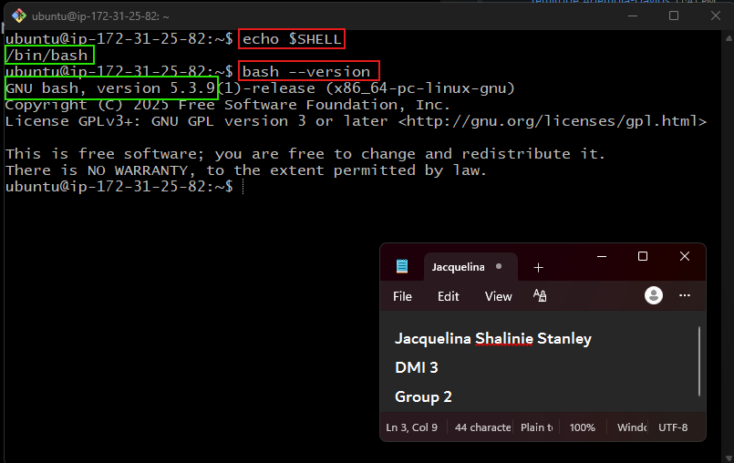

---

#### Screenshot 2 — Output of `pwd` and `ls -lah` showing the scripts directory

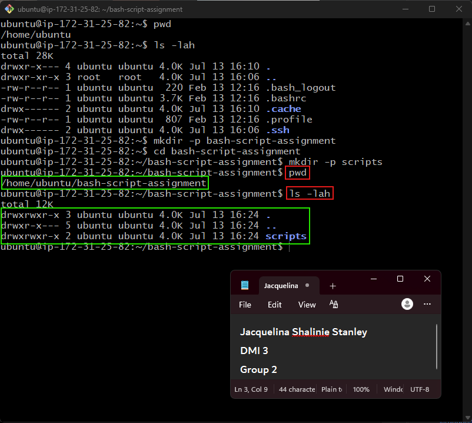

---

### Notes

Answer the following in your own words:

**1. What is Bash?**

Bash(“Bourne-Again SHell.”) is the default command shell on many Unix-like systems, and it is used to run commands and automate tasks

Bash acts as the interface between you and the operating system, so you can run programs, manage files, and chain commands together.

---

**2. What is the difference between shell and Bash?**

The main difference is that shell is the general name for a command-line interface, while Bash is one specific shell. In other words, all Bash is a shell, but not all shells are Bash

A shell is the program that interprets the commands you type and passes them to the operating system. Examples include sh, bash, zsh, ksh, and csh.
 
Bash stands for “Bourne Again SHell” and is a popular shell used on many Linux systems and macOS. It adds features such as command history, tab completion, arrays, and more convenient scripting support.

---

**3. Why is it important to confirm the Bash version before writing scripts?**

Confirming the Bash version matters because scripts may rely on features that exist only in newer releases, so an older version can cause syntax errors or unexpected behavior. It also helps you write scripts that are portable across different machines and operating systems, where Bash versions can differ.

---

# Task 2 — Your First Bash Script

## Goal

Create your first Bash script, make it executable, and run it from the terminal.

### Evidence

#### Screenshot 1 — Content of `first-script.sh`

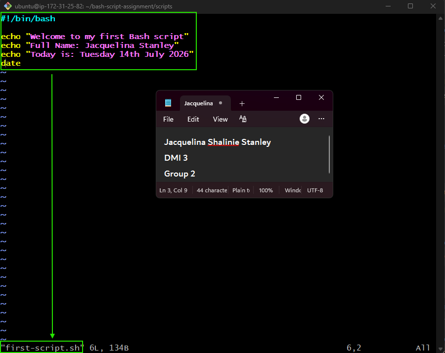

---

#### Screenshot 2 — Output of `./first-script.sh`

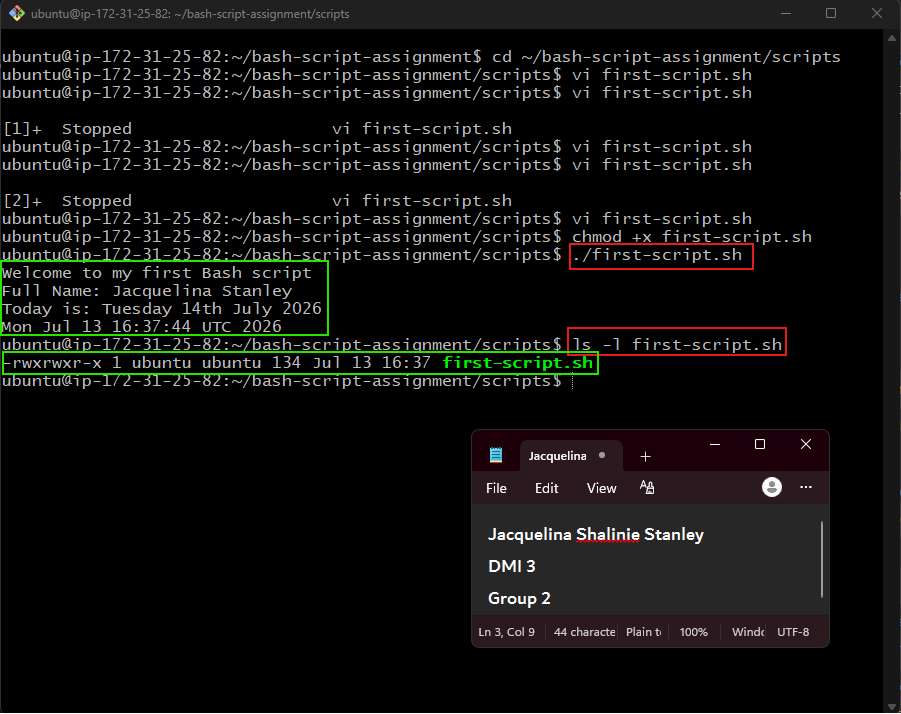

---

#### Screenshot 3 — Output of `ls -l first-script.sh` showing executable permission

---

### Notes

Answer the following in your own words:

**1. What is the purpose of `#!/bin/bash`?**

#!/bin/bash is the shebang line. It tells the operating system to run the script using Bash as the interpreter, instead of guessing or using whatever shell happens to be default.

If a script uses Bash features like arrays or [[ ... ]], #!/bin/bash helps ensure the correct shell interprets them. Without it, the script may fail or behave differently on another machine.

---

**2. Why do we use `chmod +x` before running a script?**

chmod +x gives a file execute permission, so the system is allowed to run it like a program. Without that permission, trying to launch the script directly usually results in a “Permission denied” error.

After adding execute permission, you can run the script directly with something like ./script.sh instead of typing bash script.sh every time. That makes scripts easier to use, share, and automate

---

**3. What is the difference between running a script using `./script.sh` and `bash script.sh`?**

./script.sh runs the script as an executable file, so the operating system uses the script’s shebang line to choose the interpreter. bash script.sh explicitly starts Bash and tells Bash to read the file, so it does not rely on the executable bit and it ignores the shebang for choosing the interpreter

If a script is meant to run with Bash features, ./script.sh is usually better because it respects the shebang and matches the intended interpreter. bash script.sh is useful when you want to force Bash or quickly test a script even if it is not executable yet.

If a file starts with #!/bin/zsh, then ./script.sh will use zsh, but bash script.sh will still run it with Bash, which may change behavior or break the script

---

# Task 3 — Variables: User Information Script

## Goal

Use variables to store and display user-related information.

### Evidence

#### Screenshot 1 — Content of `user-info.sh`

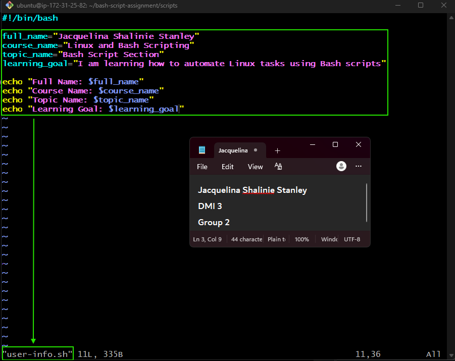

---

#### Screenshot 2 — Output of `./user-info.sh`

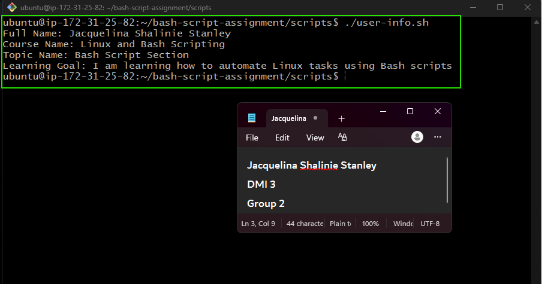

---

### Notes

Answer the following in your own words:

**1. What is a variable in Bash?**

A variable in Bash is a named place to store data so you can reuse it later in a script or command line session. Bash variables are untyped, which means they can hold text or numbers without declaring a data type first.

name="Jacquelina"
echo "$name"

In this example, name stores a value, and echo prints it.

Variables make scripts easier to read, avoid repeating the same value many times, and let you store results from commands or calculations. They are also commonly used for configuration values, file paths, and user input

---

**2. Why should we avoid spaces around the `=` sign when creating variables?**

Because in Bash, spaces separate tokens. If you write name = John, Bash does not see a variable assignment; it sees a command named name with arguments = and John, which usually causes an error

Bash treats whitespace as a separator in commands, so the = sign only means assignment when it is directly attached to the variable name. This design keeps the shell’s command parsing consistent.

---

**3. How do you access the value stored inside a Bash variable?**

To access a Bash variable’s, adding a $ in front of the value its name. For example, if name="Alice", then echo "$name" prints Alice.

name="Alice"
echo "$name"

You can also use ${name}. That form is especially useful when the variable is next to other text, like echo "${name}123", so Bash knows exactly where the variable name ends.

---

# Task 4 — Arrays & Loops: Tools Checklist Script

## Goal

Use arrays and loops to print a checklist of tools used in Bash scripting.

### Evidence

#### Screenshot 1 — Content of `tools-checklist.sh`

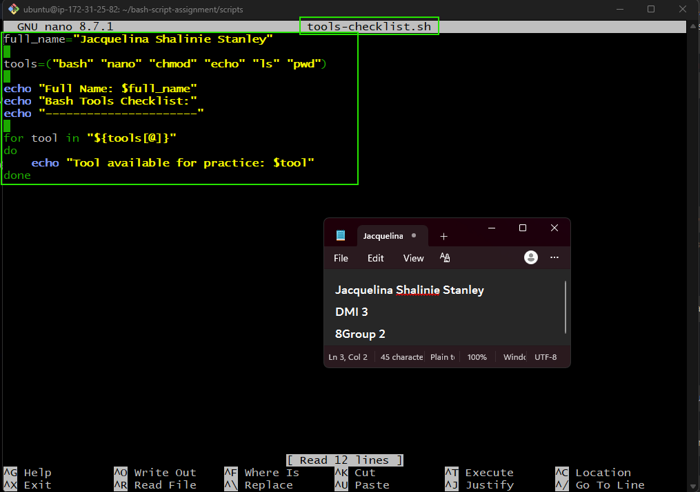

---

#### Screenshot 2 — Output of `./tools-checklist.sh`

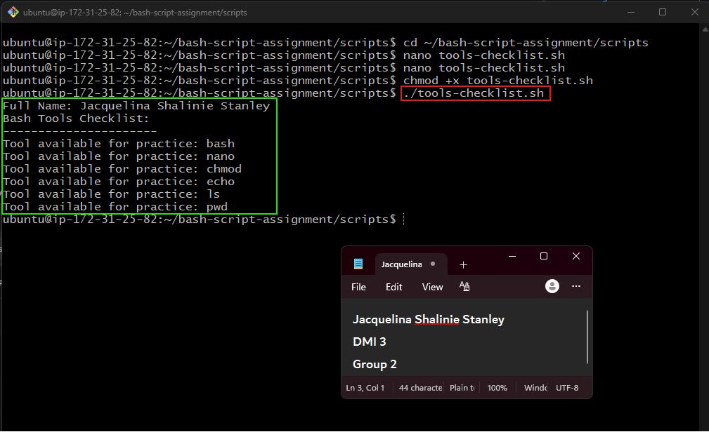

---

### Notes

Answer the following in your own words:

**1. What is an array in Bash?**

An array in Bash is a variable that can store multiple values instead of just one. Bash arrays are usually indexed starting at 0, so the first item is at index 0, the second at 1, and so on.

Arrays make scripts cleaner when you need to process several related values. Instead of creating many separate variables, you can keep everything in one structure and access each item by its index.

---

**2. Why are arrays useful in scripts?**

Arrays are useful in scripts because they let you store many related values under one variable name, which makes code simpler to read and manage. They also make it easier to loop through items, access values by index, and add or remove elements as needed.

Instead of creating separate variables for each item, you can keep a list together in one structure. That is especially handy when working with repeated data such as names, file paths, or options.

---

**3. What does `"${tools[@]}"` mean?**

In Bash, "${tools[@]}" means “expand every element of the array tools as a separate word, while preserving spaces inside each element.” Bash specifically treats ${name[@]} as an exception that expands each array member individually, and the quotes prevent word splitting and filename expansion.

If tools=("git" "curl" "my file.txt"), then "${tools[@]}" expands to three separate arguments: git, curl, and my file.txt. That is usually what you want when passing an array to a command.

Without the quotes, elements containing spaces can get split into multiple words, which changes the arguments your script passes. Quoting "${tools[@]}" keeps each array item intact.

---

**4. What is the purpose of the `for` loop in this script?**

The purpose is to automate repetitive output, instead of writing six separate echo statements, the loop handles all six items concisely. This makes the script easier to maintain; if you add or remove tools from the array, the loop automatically adjusts without changing the rest of the code.

---

# Task 5 — Loops: Number Counter Script

## Goal

Use loops to repeat a task multiple times.

### Evidence

#### Screenshot 1 — Content of `counter.sh`

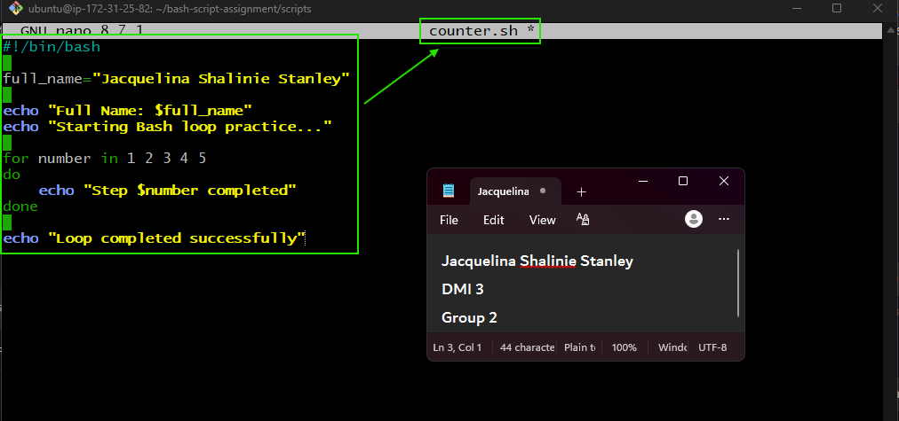

---

#### Screenshot 2 — Output of `./counter.sh`

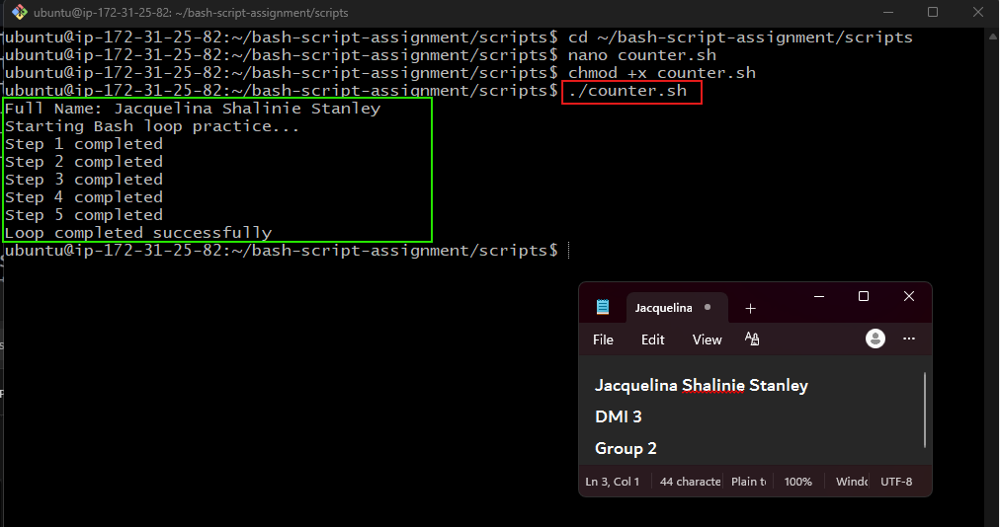

---

### Notes

Answer the following in your own words:

**1. What is a loop?**

A loop is a set of instructions that repeats until a stopping condition is met. In programming, loops let a program do the same task many times without writing the code again and again.

---

**2. Why do we use loops in Bash scripting?**

We use loops in Bash scripting to automate repeated tasks, so you can run the same commands over and over without rewriting them. They’re also useful for iterating through lists of items, files, or conditions until something changes.

---

**3. How many times did the loop run in your script?**

The script loops the output 5 times 

---

**4. What would you change if you wanted the loop to run 10 times?**

To make the loop run 10 times, change the range from 1 2 3 4 5 to 1 2 3 4 5 6 7 8 9 10, or use a range form like 1..10 in Bash. A Bash for loop can iterate over a list of values or a numeric sequence like for i in {1..10}; do 

for i in {1..10}; do
  echo $i
done

---

# Task 6 — Files & Conditionals: File Validation Script

## Goal

Use file checks and conditionals to verify whether files and directories exist.

### Evidence

#### Screenshot 1 — Output of `ls -lah ../test-folder`

W3-A5-T6-S1

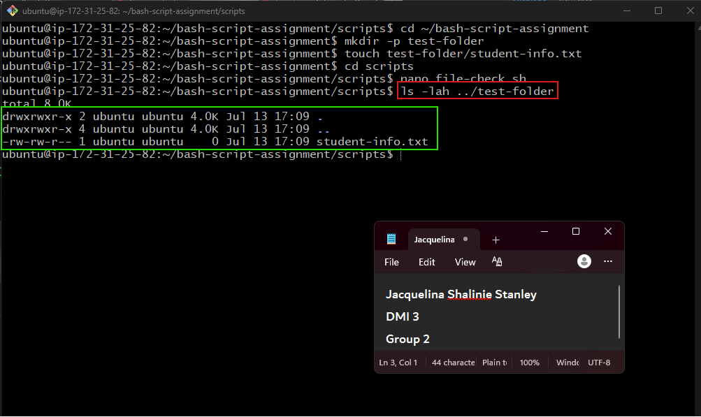

---

#### Screenshot 2 — Content of `file-check.sh`

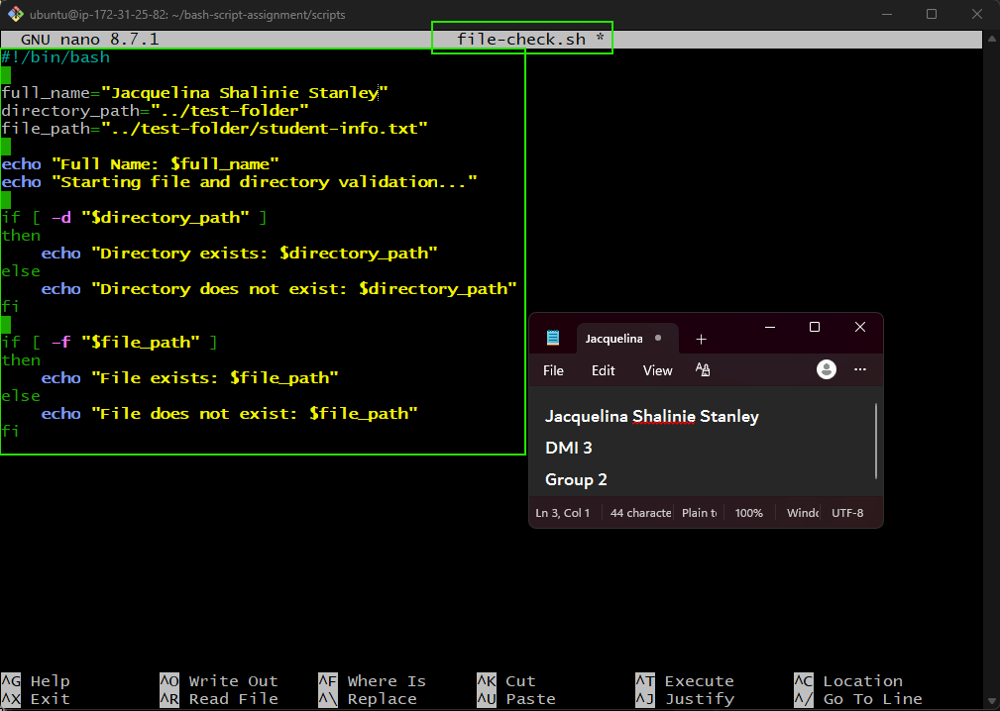

---

#### Screenshot 3 — Output of `./file-check.sh`

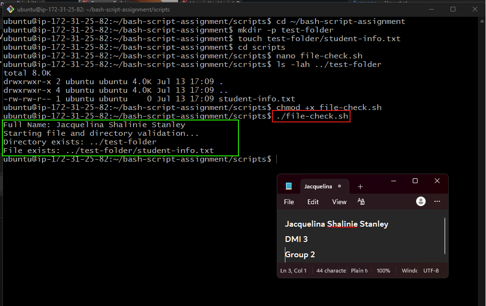

---

### Notes

Answer the following in your own words:

**1. What does `-d` check in Bash?**

In Bash, -d checks whether a path exists and is a directory. For example, [ -d "/tmp" ] is true if /tmp is a directory.

---

**2. What does `-f` check in Bash?**

In Bash, -f is a conditional expression used (typically inside [ ... ] or [[ ... ]]) to check:

---

**3. Why should file and directory paths be stored in variables?**

File and directory paths should be stored in variables in Bash primarily to improve maintainability, avoid errors with special characters (like spaces), and make scripts more flexible and reusable.

---

**4. What happens if the file does not exist?**

Add your answer here.

---

# Task 7 — Conditionals: Pass or Retry Script

## Goal

Use if-else conditionals to make decisions based on a variable value.

### Evidence

#### Screenshot 1 — Content of `score-check.sh` with `score=85`

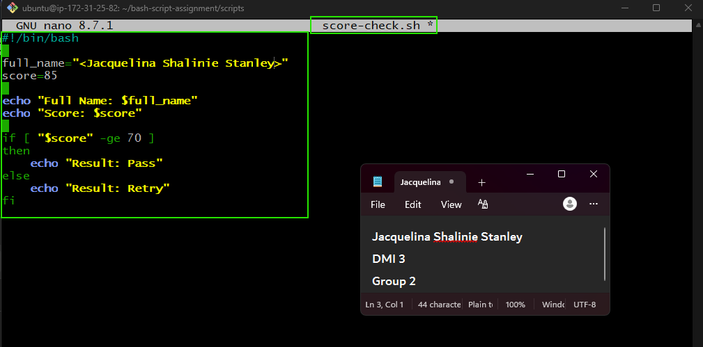

---

#### Screenshot 2 — Output showing `Result: Pass`

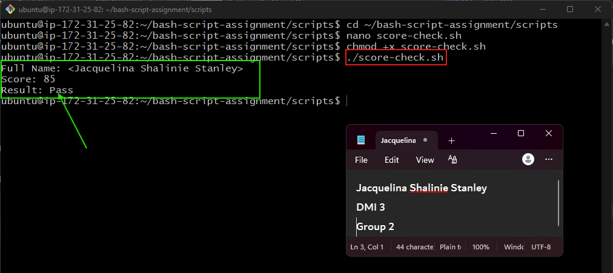

---

#### Screenshot 3 — Content of `score-check.sh` with `score=55`

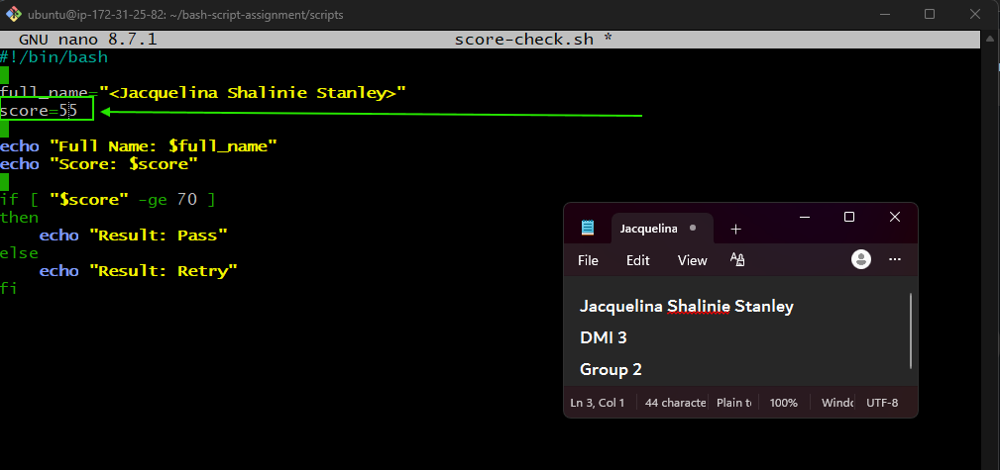

---

#### Screenshot 4 — Output showing `Result: Retry`

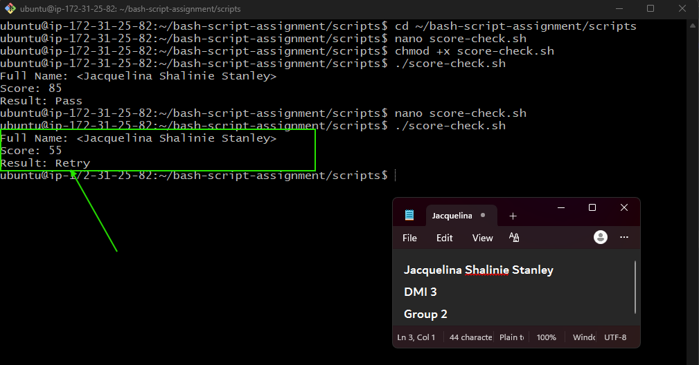

---

### Notes

Answer the following in your own words:

**1. What is the purpose of if-else in Bash?**

Add your answer here.

---

**2. What does `-ge` mean?**

Add your answer here.

---

**3. Why should conditions be tested with different values?**

Add your answer here.

---

**4. How can conditionals help in automation scripts?**

Add your answer here.

---

# Task 8 — Functions: Final Bash Automation Script

## Goal

Create a final Bash script using functions to organize reusable code.

### Evidence

#### Screenshot 1 — Content of `final-automation.sh`

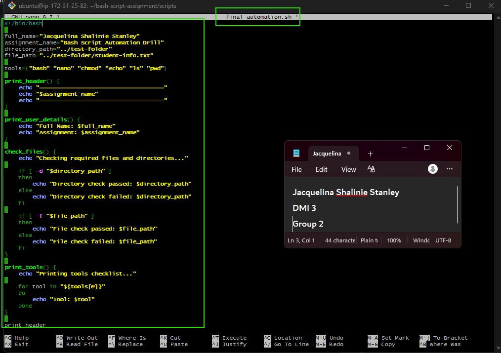

---

#### Screenshot 2 — Output of `./final-automation.sh`

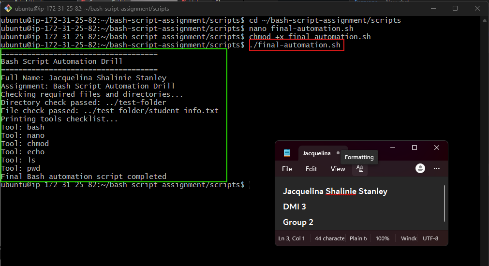

---

#### Screenshot 3 — Output of `ls -lah` showing all created scripts

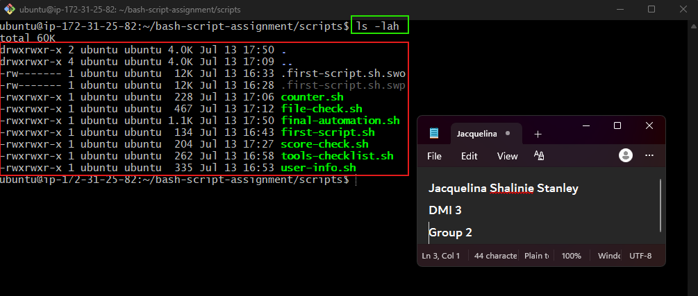

---

### Notes

Answer the following in your own words:

**1. What is a function in Bash?**

Add your answer here.

---

**2. Why are functions useful in scripts?**

Add your answer here.

---

**3. Which functions did you create in this script?**

Add your answer here.

---

**4. How does this final script combine variables, arrays, loops, conditionals, files, and functions?**

Add your answer here.

---

# LinkedIn Post (Required)

## Evidence

#### LinkedIn Post URL

Paste your LinkedIn post URL here:

`__________________________`

---

#### Screenshot — Published LinkedIn post

Add your screenshot here.

---

# Submission Instructions

- Add all required screenshots in your submission
- Full name must be visible in required screenshots
- All script files must be created and run successfully
- Required notes must be answered clearly for every task
- Do not expose sensitive information (keys, passwords, credentials)

---

# Completion Checklist

- [✅] Task 1: Environment setup verified, workspace created (Screenshots 1–2, Notes answered)
- [✅] Task 2: First script created, executed, permissions verified (Screenshots 1–3, Notes answered)
- [✅] Task 3: Variables script created and run (Screenshots 1–2, Notes answered)
- [✅] Task 4: Arrays and loops script created and run (Screenshots 1–2, Notes answered)
- [✅] Task 5: Counter loop script created and run (Screenshots 1–2, Notes answered)
- [✅] Task 6: File validation script created and run (Screenshots 1–3, Notes answered)
- [✅] Task 7: Pass/Retry conditional script tested with both values (Screenshots 1–4, Notes answered)
- [✅] Task 8: Final automation script created and run (Screenshots 1–3, Notes answered)
- [✅] All scripts run without errors
- [✅] Full Name visible in all required screenshots
- [✅] LinkedIn post published and URL submitted
- [✅] No sensitive data exposed

---

## 📌 About DMI & CloudAdvisory

DevOps Micro Internship (DMI) is a project-based DevOps program run by Pravin Mishra (The CloudAdvisory) focused on real-world execution, systems thinking, and career readiness.

It helps learners build strong DevOps foundations with hands-on experience.

---

## 📌 Resources

- 🌐 DMI Official Website: https://pravinmishra.com/dmi  
- 🎓 DevOps for Beginners (Udemy): https://www.udemy.com/course/devops-for-beginners-docker-k8s-cloud-cicd-4-projects/  
- 🎓 Agentic AI DevOps with Claude Code: https://www.udemy.com/course/ultimate-agentic-ai-devops-with-claude-code/  
- 🎓 DevOps with Claude Code: Terraform, EKS, ArgoCD & Helm: https://www.udemy.com/course/devops-with-claude-code-terraform-eks-argocd-helm/  
- ▶️ YouTube Playlist: https://www.youtube.com/playlist?list=PLFeSNDtI4Cho  
- 🔗 Pravin Mishra (LinkedIn): https://www.linkedin.com/in/pravin-mishra-aws-trainer/  
- 🏢 CloudAdvisory (LinkedIn): https://www.linkedin.com/company/thecloudadvisory/

---

*This submission is part of DevOps Micro Internship (DMI) Cohort 3 — Agentic AI Track.*