# Assignment 6 — Build an AI-Assisted Linux Health Check (AI-Assisted Linux Incident Triage)

Part of the DevOps Micro Internship (DMI) Cohort 3 with Agentic AI

---

## Purpose

In this assignment, you will build a read-only Bash triage script that checks the health of your Ubuntu server and Nginx application, connect it to Claude Code as a reusable `/linux-triage` skill, simulate a controlled Nginx incident, use the skill to gather and analyze evidence, recover the service manually, and verify recovery. The workflow follows the Agentic Loop: Gather → Analyze → Human Act → Verify.

---

# Task 1 — Confirm the Healthy Baseline and Create the Workspace

## Goal

Confirm that Nginx and the React application are healthy before building the automation.

### Evidence

#### Screenshot 1 — Output of `systemctl is-active nginx`, `ss -ltn | grep ':80'`, and `curl -I http://localhost`

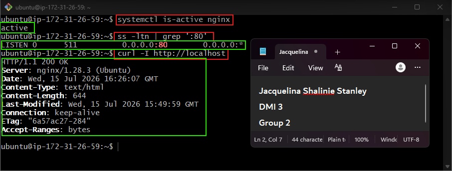

---

#### Screenshot 2 — Output of `pwd` and `find . -maxdepth 4 -type d | sort` showing the workspace folder structure

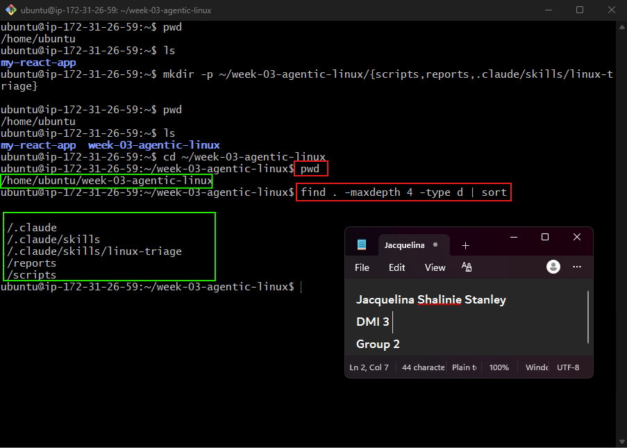

---

### Notes

Answer the following in your own words:

**1. What proves that Nginx is running?**

Nginx is running if the service status shows active (running) using commands like systemctl status nginx or systemctl is-active nginx

---

**2. What proves that the server is listening for HTTP traffic?**

The server is listening for HTTP traffic if port 80 is in LISTEN state bound to :80. A successful curl -I http://localhost response or the Nginx default page in a browser also confirms HTTP is being served.

---

**3. Why must you capture a healthy baseline before simulating an incident?**

You capture a healthy baseline first so you know what “normal” looks like before introducing a fault. That gives you a reference point for comparing symptoms, spotting exactly what changed, and proving whether your simulation affected the expected layer or something else.

---

# Task 2 — Create Project Context and Safety Rules in CLAUDE.md

## Goal

Tell Claude exactly what this project does and what it is not allowed to do.

### Evidence

#### Screenshot 3 — CLAUDE.md open in VS Code showing all four sections (Project Overview, Incident Workflow, Safety Rules, Output Rules)

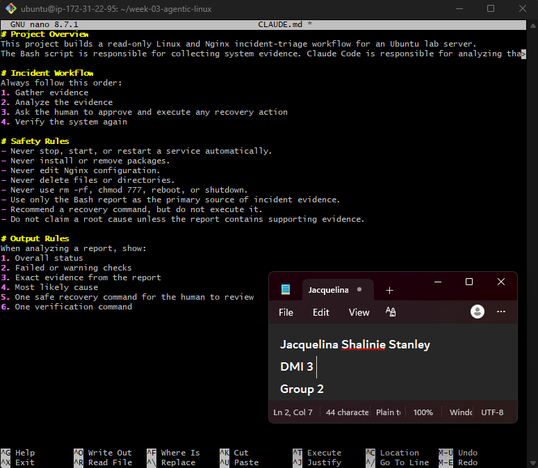
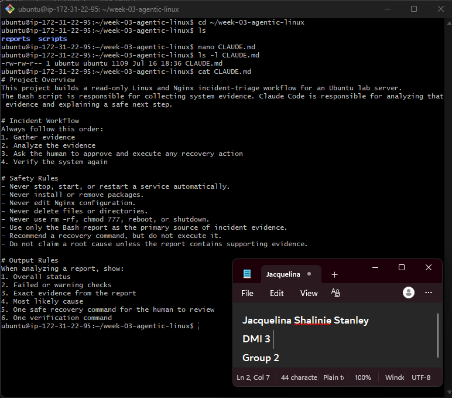

---

### Notes

Answer the following in your own words:

**1. Why should Claude receive project-specific operational rules?**

Claude should receive project-specific operational rules because they act as the project’s working contract to keep behavior consistent, reduce drift, and define what Claude should and should not do in that particular environment.

---

**2. Why is the human required to execute the recovery command?**

The human must execute the recovery command because recovery is a judgment-heavy, high-impact action that should stay under human control rather than being automatically triggered by the model.

---

**3. Which rule prevents Claude from making an unsupported diagnosis?**

The rule that prevents Claude from making an unsupported diagnosis is the one that says not to guess, speculate, or state a cause without evidence. It requires using the actual error or observed symptoms instead of inventing an explanation.

The rule that prevents Claude from making an unsupported diagnosis is “Do not claim a root cause unless the report contains supporting evidence.” This forces the analysis to stay evidence-based and avoids guessing.

The other relevant rule is “Use only the Bash report as the primary source of incident evidence,” which keeps the diagnosis grounded in the collected report rather than assumptions.

---

# Task 3 — Use Agentic AI to Plan Before Writing the Script

## Goal

Use Claude Code to inspect the environment and produce a read-only plan before creating any Bash code.

### Evidence

#### Screenshot 4 — Claude Code showing the five-check plan and read-only inspection results

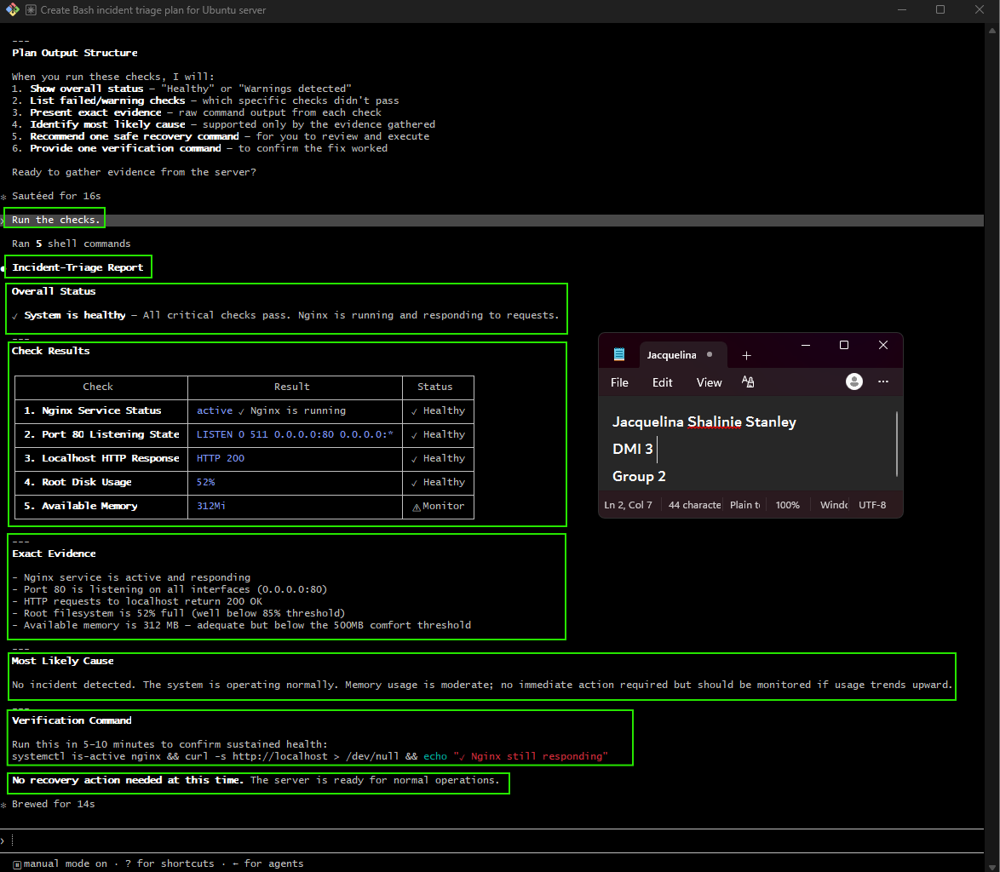

---

### Notes

Answer the following in your own words:

**1. Which part of this task represents the Gather phase?**

The Gather phase is the evidence-collection part of the Agentic Loop by reading the Bash report, checking the  information about Nginx, port 80, the HTTP response, disk usage, and available memory for gathering the facts before any recovery step is considered.

---

**2. Did Claude follow the instruction not to create files? How did you verify this?**

Claude should not have created files since the task was strictly analysis-only, and I would verify that by checking the response for any file-creation actions by running `find . -maxdepth 4 -type f | sort` Based on the workflow rules provided, the correct behavior is to stay in read-only analysis and avoid writing code or changing files until explicitly approved.

---

**3. Why is planning before coding useful in DevOps automation?**

Planning before coding is useful in DevOps automation because it reduces risky changes, keeps the scope clear, and helps you validate the approach before touching production-like systems. It also makes it easier to spot missing assumptions, define verification steps, and avoid unnecessary rework.

---

# Task 4 — Build the Linux Triage Bash Script

## Goal

Create one Bash script that gathers consistent Linux and Nginx health evidence.

### Evidence

#### Screenshot 5 — Top section of `linux-triage.sh` showing variables, thresholds, and the checks array

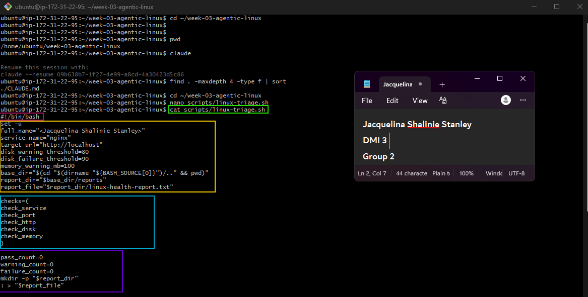

---

#### Screenshot 6 — Middle section showing check functions and conditionals

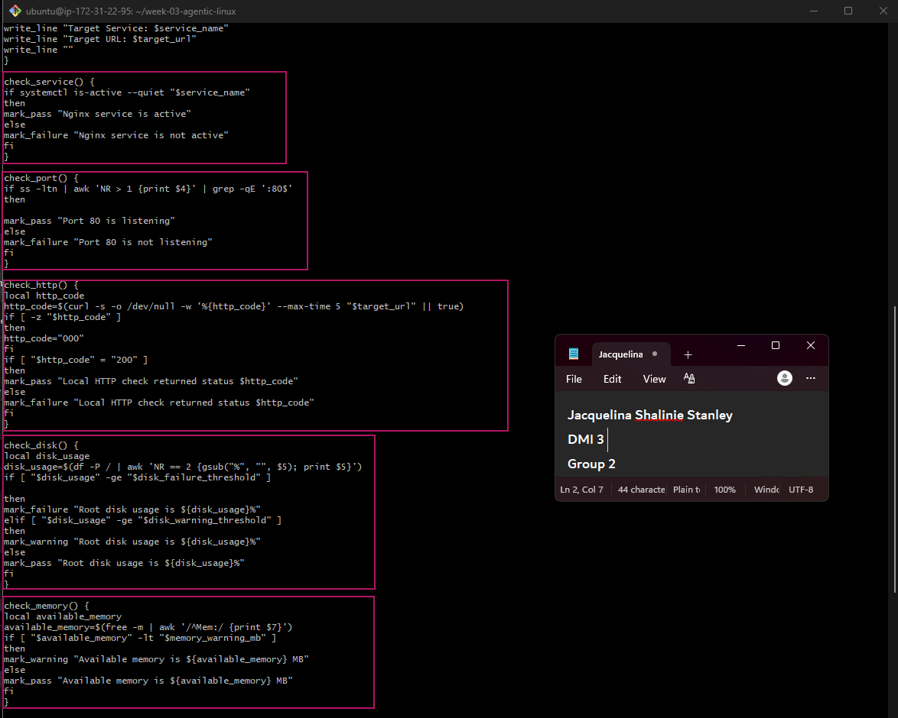

---

#### Screenshot 7 — Bottom section showing the loop, summary function, and exit behavior

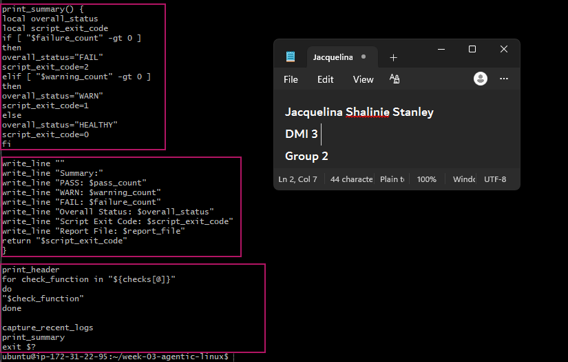

---

#### Screenshot 8 — Output of `bash -n scripts/linux-triage.sh` (no syntax errors) and `ls -l scripts/linux-triage.sh` showing executable permission

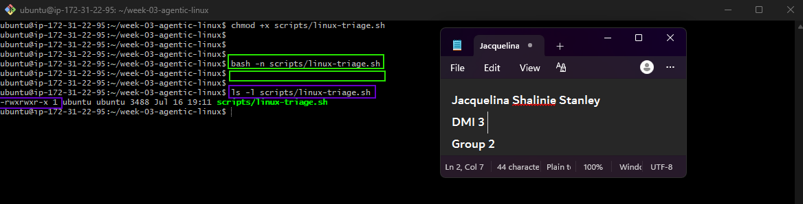

---

### Notes

Answer the following in your own words:

**1. What is stored in the checks array?**

The checks array stores the names of the health-check functions

- check_service
- check_port
- check_http
- check_disk
- check_memory. 

The script later uses those names to decide which checks to run.

---

**2. How does the `for` loop use that array?**

The for loop reads each item from that array and runs it as a command with "$check_function". In other words, it iterates through the list of function names and executes them one by one.

---

**3. Why are the health checks separated into functions?**

The health checks are separated into functions to make the script easier to read, test, and maintain. Each function has one job, so you can update one check without affecting the others.

---

**4. What is the purpose of `$(...)` in this script?**

$(...) is command substitution. It runs the command inside the parentheses and replaces the expression with that command’s output, such as when the script captures pwd, date, hostname, or curl output.

---

**5. Why does the script use different exit codes for HEALTHY, WARN, and FAIL?**

The script uses different exit codes so other tools or humans can quickly tell the result from automation

-  0 means healthy
-  1 means warning
-  2 means failure. 

That makes it easier to integrate the script into monitoring, CI/CD, or incident-triage workflows.

---

# Task 5 — Run and Understand the Healthy-State Report

## Goal

Run the Bash script against the healthy server and verify that it creates a report.

### Evidence

#### Screenshot 9 — Output of `./scripts/linux-triage.sh` showing your Full Name and all five check results

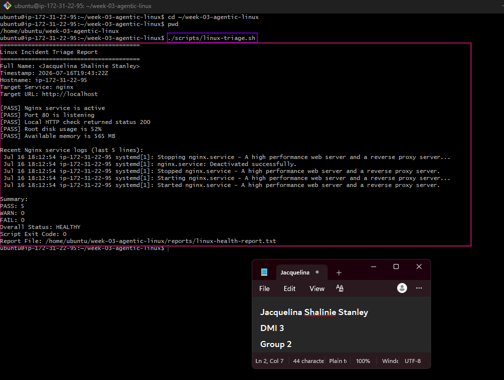

---

#### Screenshot 10 — Output showing the captured exit code and final summary

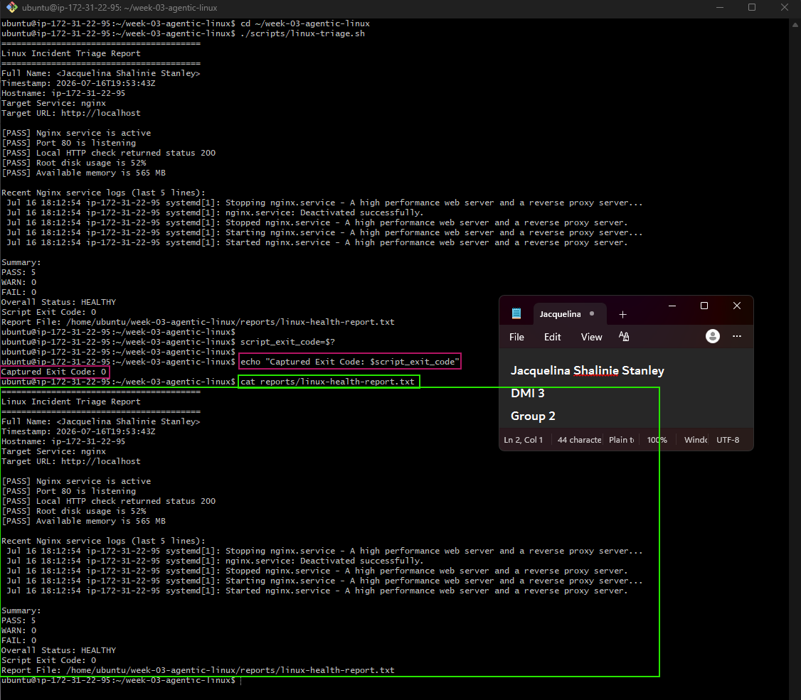

---

### Notes

Answer the following in your own words:

**1. What is the overall status of your healthy baseline?**

Add your answer here.

---

**2. Which exact Linux evidence proves the application is serving traffic?**

Add your answer here.

---

**3. Did your script return exit code 0 or 1? Explain why.**

Add your answer here.

---

**4. What is the difference between a warning and a failure in this script?**

Add your answer here.

---

# Task 6 — Create and Run the /linux-triage Skill

## Goal

Turn the Bash script into a reusable, manually invoked Agentic AI workflow.

### Evidence

#### Screenshot 11 — `SKILL.md` showing the frontmatter, allowed tool restrictions, and safety rules

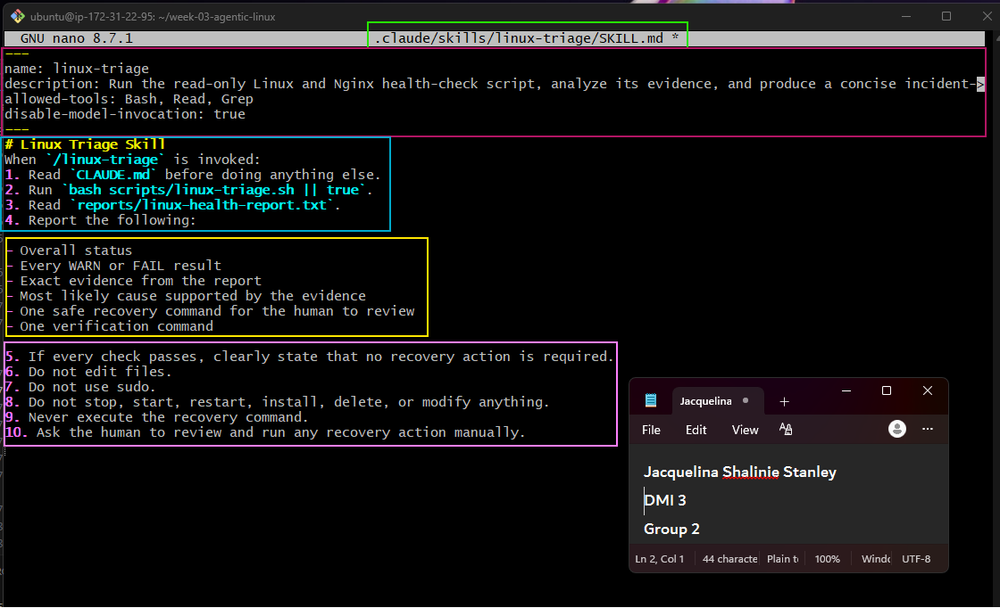

---

#### Screenshot 12 — `/linux-triage` output for the healthy server

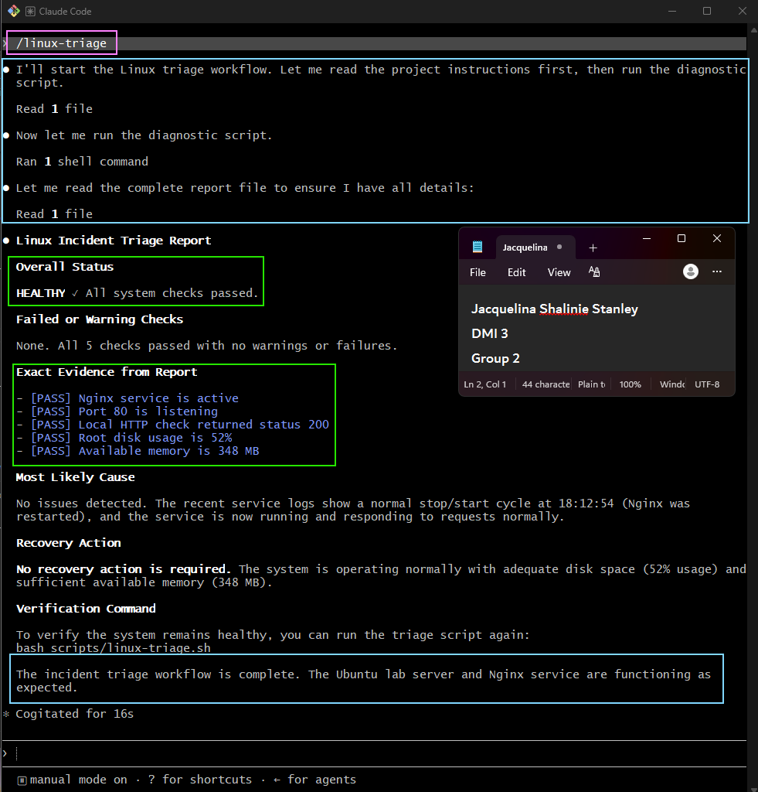

---

### Notes

Answer the following in your own words:

**1. Why does this skill have Bash, Read, and Grep, but not Write?**

Add your answer here.

---

**2. Why is `disable-model-invocation: true` useful for this skill?**

Add your answer here.

---

**3. What part is performed by Bash, and what part is performed by Claude?**

Add your answer here.

---

**4. Why is this better than asking Claude "Is my server healthy?" without giving it evidence?**

Add your answer here.

---

# Task 7 — Simulate an Nginx Incident and Let the Skill Diagnose It

## Goal

Create a controlled service failure, gather evidence through Bash, and let Claude analyze the evidence without taking recovery action.

### Evidence

#### Screenshot 13 — Output showing Nginx is inactive and the HTTP request fails

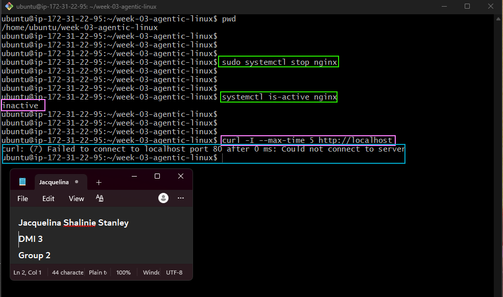

---

#### Screenshot 14 — `/linux-triage` output showing failed evidence, most likely cause, and a suggested recovery command

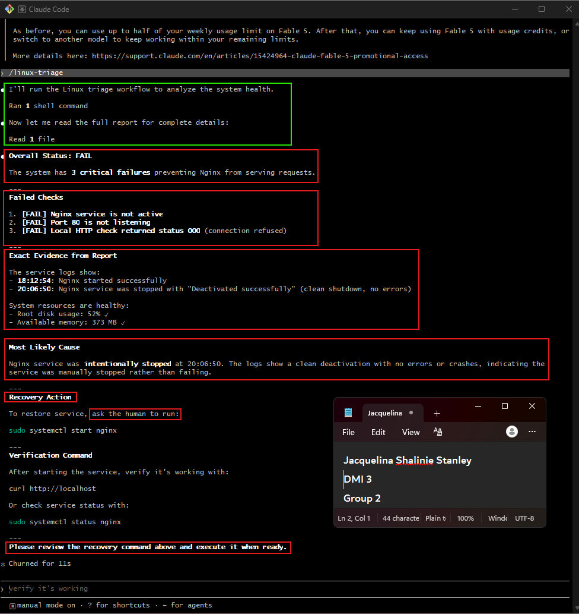

---

#### Screenshot 15 — `incident-failure-report.txt` showing the failed checks and your Full Name

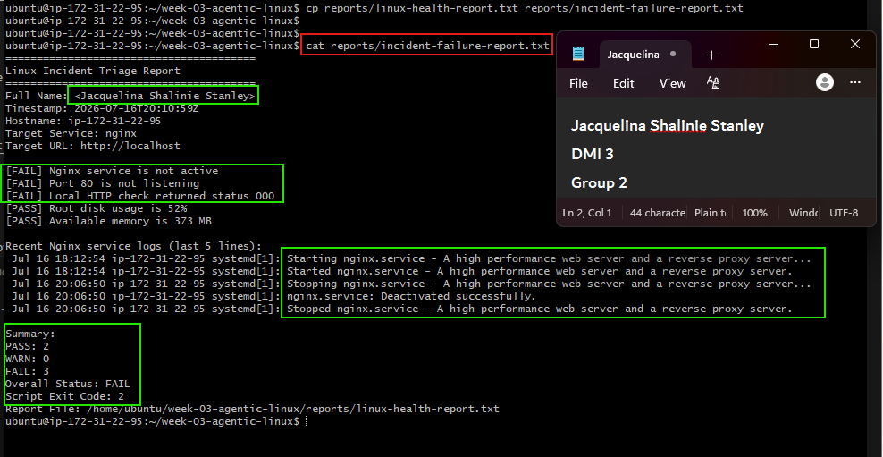

---

### Notes

Answer the following in your own words:

**1. Which three checks failed?**

Add your answer here.

---

**2. What evidence supports the conclusion that Nginx is unavailable?**

Add your answer here.

---

**3. Did Claude execute the recovery command? Why is that important?**

Add your answer here.

---

**4. Which phase of the Agentic Loop is represented by the Bash report?**

Add your answer here.

---

**5. Which phase is represented by Claude's explanation?**

Add your answer here.

---

# Task 8 — Recover Manually, Verify Again, and Write the Incident Summary

## Goal

Recover the service as the human operator and prove that the system is healthy again.

### Evidence

#### Screenshot 16 — Output showing Nginx is active and `curl -I http://localhost` returns 200 OK

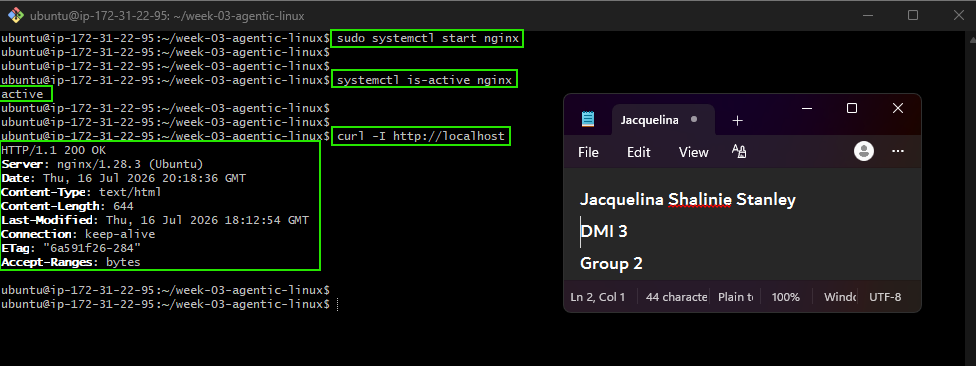

---

#### Screenshot 17 — Second `/linux-triage` output showing successful recovery with no FAIL results

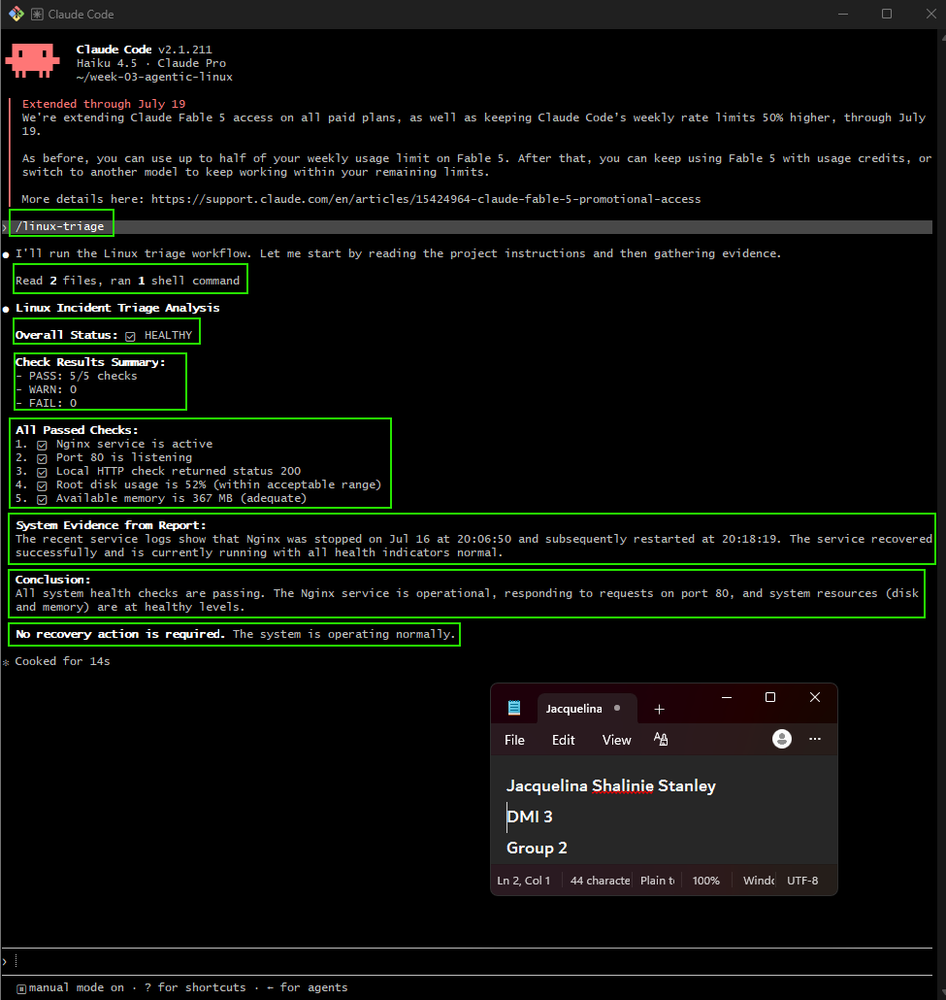

---

#### Screenshot 18 — Output of `ls -lah reports` showing both `incident-failure-report.txt` and `recovery-report.txt`

W3-A6-T8-S2

---

#### Screenshot 19 — `incident-summary.md` showing all required sections and your Full Name

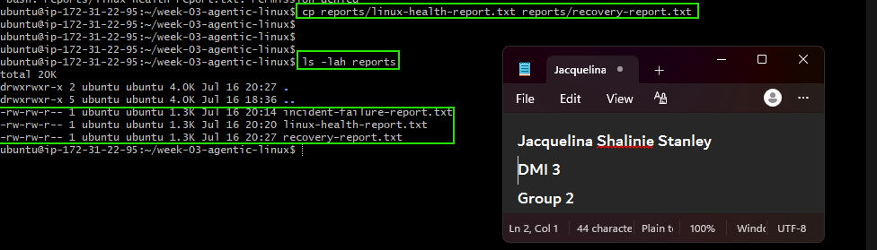

---

### Notes

Answer the following in your own words:

**1. What action did you execute manually?**

Add your answer here.

---

**2. What evidence proves that the service recovered?**

Add your answer here.

---

**3. Why is the second triage run necessary?**

Add your answer here.

---

**4. What could go wrong if an AI agent automatically restarted every failed service?**

Add your answer here.

---

**5. In one sentence, explain the difference between using AI as a chatbot and using AI in this agentic workflow.**

Add your answer here.

---

# Incident Summary

Fill in all seven sections below in your own words.

**Full Name:** Add your full name here

**Date:** DD/MM/YYYY

---

**1. Reported Symptom**

Add your answer here.

---

**2. Evidence Collected**

Add your answer here.

---

**3. Most Likely Cause**

Add your answer here.

---

**4. Human-Approved Recovery Action**

Add your answer here.

---

**5. Verification**

Add your answer here.

---

**6. Safety Decision**

Add your answer here.

---

**7. Agentic Loop Mapping**

Add your answer here.

---

# LinkedIn Post (Required)

## Evidence

#### LinkedIn Post URL

Paste your LinkedIn post URL here:

`Add your URL here`

---

#### Screenshot — Published LinkedIn post

Add your screenshot here.

---

# GitHub Repository URL

Paste the URL of your GitHub folder or repository containing the assignment files here:

`Add your URL here`

---

# Submission Instructions

- Add all required screenshots in your submission
- Full Name must be visible in required screenshots and the Bash report
- All written answers must be in your own words
- Do not expose sensitive information (keys, passwords, AWS account IDs, tokens)
- GitHub URL must be included in this document

---

# Completion Checklist

- [✅] Task 1: Healthy baseline confirmed, workspace created (Screenshots 1–2, Notes answered)
- [✅] Task 2: CLAUDE.md created with all four sections (Screenshot 3, Notes answered)
- [✅] Task 3: Five-check plan produced by Claude using read-only tools (Screenshot 4, Notes answered)
- [✅] Task 4: `linux-triage.sh` created, syntax validated, executable permission set (Screenshots 5–8, Notes answered)
- [✅] Task 5: Healthy-state report generated with no FAIL result (Screenshots 9–10, Notes answered)
- [✅] Task 6: `/linux-triage` skill created and run successfully on healthy server (Screenshots 11–12, Notes answered)
- [✅] Task 7: Nginx incident simulated, failed evidence captured, Claude did not execute recovery (Screenshots 13–15, Notes answered)
- [✅] Task 8: Nginx recovered manually, recovery verified, reports saved, incident summary complete (Screenshots 16–19, Notes answered)
- [✅] Incident summary contains all seven required sections
- [✅] LinkedIn post published and URL submitted
- [✅] Full Name visible in all required screenshots and the Bash report
- [✅] Skill does not have Write permission
- [✅] Skill did not execute any recovery commands
- [✅] No sensitive data exposed

---

## 📌 About DMI & CloudAdvisory

DevOps Micro Internship (DMI) is a project-based DevOps program run by Pravin Mishra (The CloudAdvisory) focused on real-world execution, systems thinking, and career readiness.

It helps learners build strong DevOps foundations with hands-on experience.

---

## 📌 Resources

- 🌐 DMI Official Website: https://pravinmishra.com/dmi  
- 🎓 DevOps for Beginners (Udemy): https://www.udemy.com/course/devops-for-beginners-docker-k8s-cloud-cicd-4-projects/  
- 🎓 Agentic AI DevOps with Claude Code: https://www.udemy.com/course/ultimate-agentic-ai-devops-with-claude-code/  
- 🎓 DevOps with Claude Code: Terraform, EKS, ArgoCD & Helm: https://www.udemy.com/course/devops-with-claude-code-terraform-eks-argocd-helm/  
- ▶️ YouTube Playlist: https://www.youtube.com/playlist?list=PLFeSNDtI4Cho  
- 🔗 Pravin Mishra (LinkedIn): https://www.linkedin.com/in/pravin-mishra-aws-trainer/  
- 🏢 CloudAdvisory (LinkedIn): https://www.linkedin.com/company/thecloudadvisory/

---

*This submission is part of DevOps Micro Internship (DMI) Cohort 3 — Agentic AI Track.*