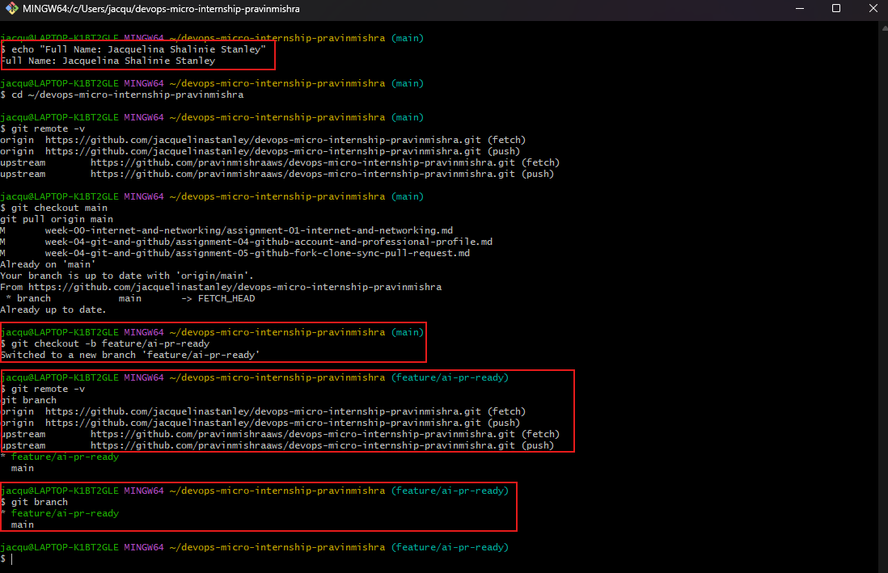
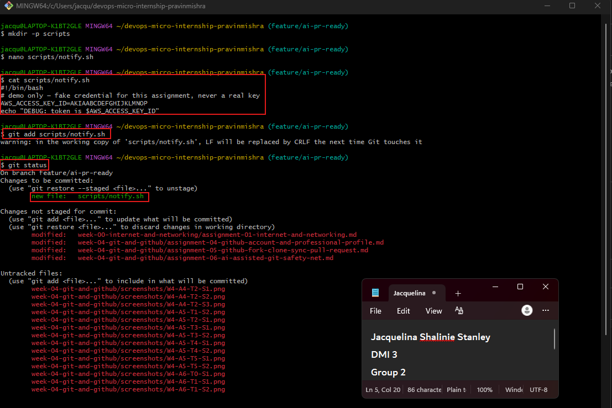
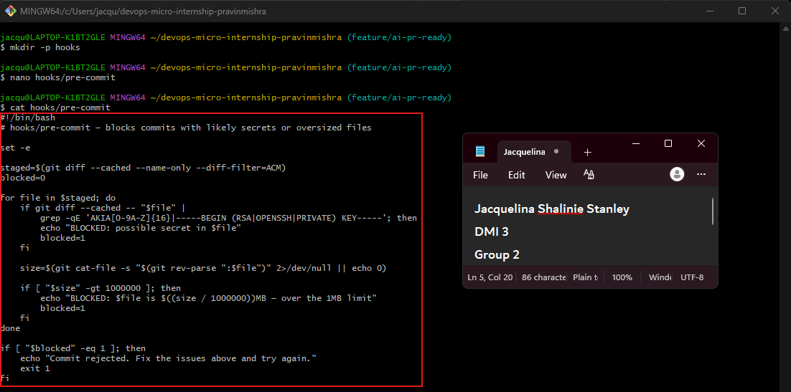
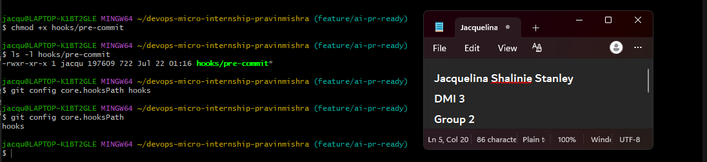
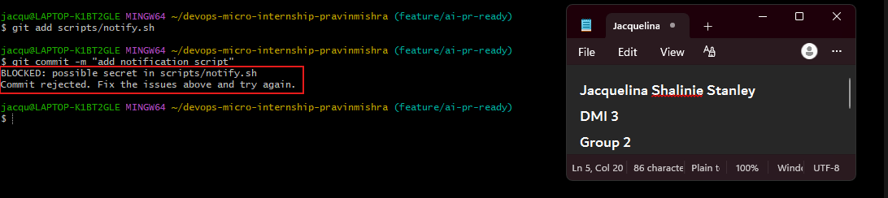
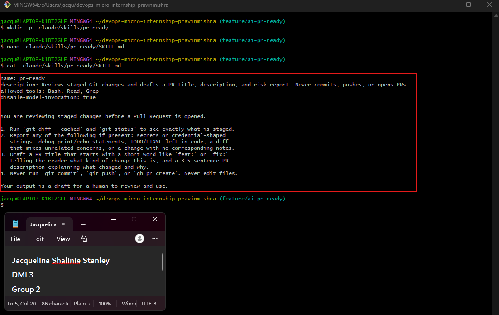
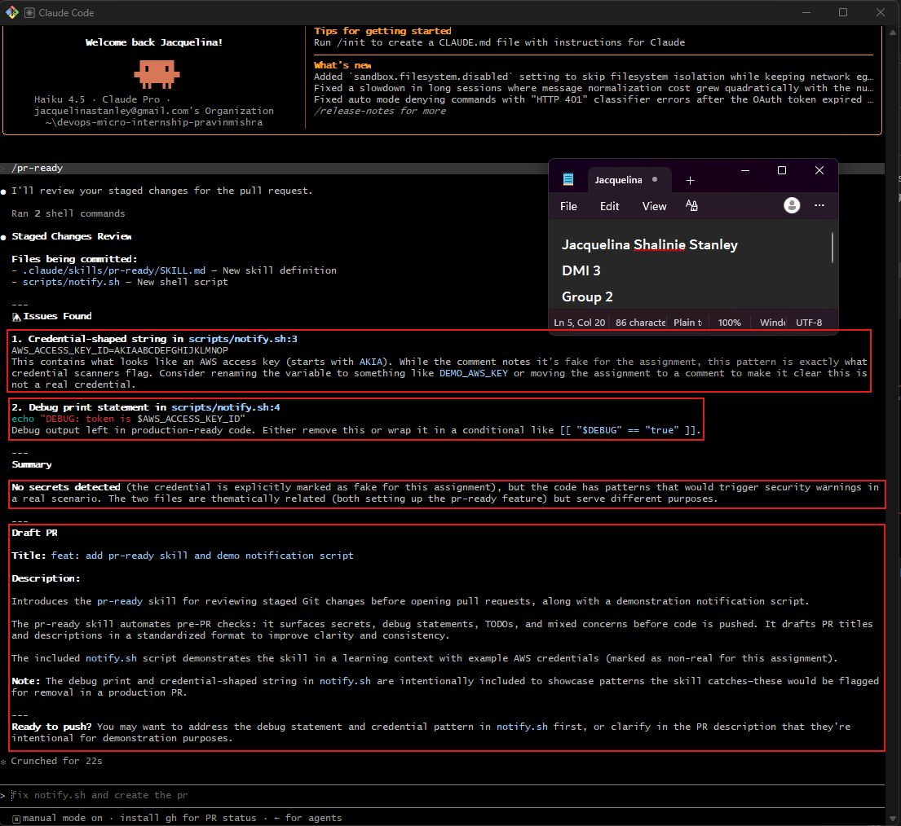
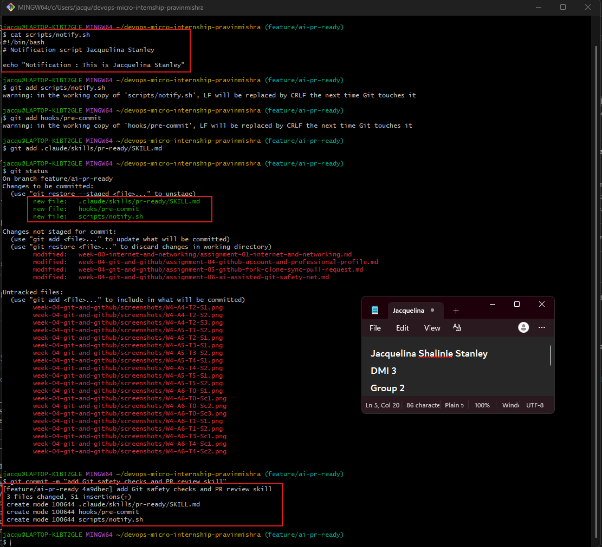
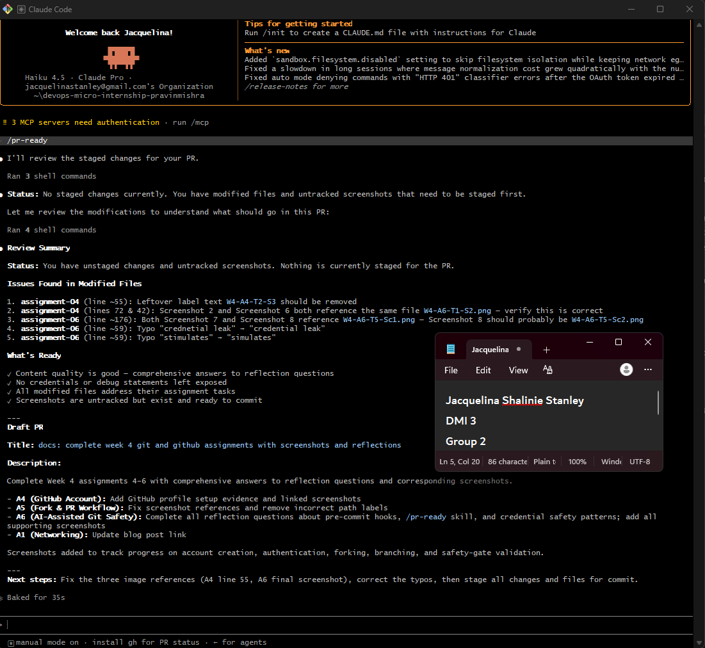
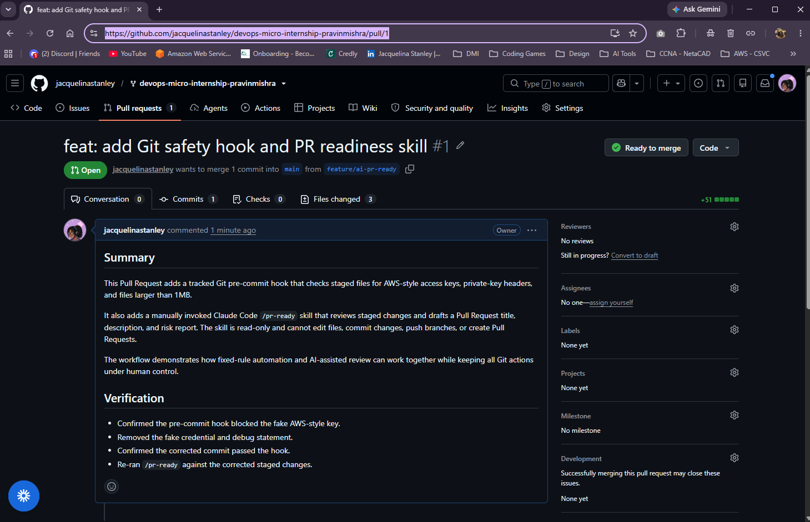

# Assignment 6 — Building an AI-Assisted Git Safety Net (PR Ready Check)

Part of the DevOps Micro Internship (DMI) Cohort 3 with Agentic AI

---

## Purpose

In Week 2 you built Claude Code hooks that block a dangerous action *before* it happens (`PreToolUse`), and a restricted skill that could look but not touch (`allowed-tools` without `Write`). In this assignment you will discover that Git has the exact same idea, decades older: a **pre-commit hook** that blocks a commit before it's created.

You will build both halves of a real "PR Ready" workflow:

1. A **Git hook that follows fixed rules** — scans staged changes for hardcoded secrets and oversized files and refuses the commit. No AI involved, no guessing, just a rule that gives the same answer every time.
2. A **restricted Claude Code skill** (`/pr-ready`) that reads your staged diff and drafts a Pull Request title, description, and a short list of things worth a second look — the kind of judgment a fixed rule can't make (mixed changes, missing context, unclear intent). The skill never commits, pushes, or opens the PR. You do that yourself, using its draft as a starting point.

This mirrors the Agentic Loop from Week 3's Linux triage assignment: **Gather → Analyze → Human Act → Verify**. The hook and the skill both gather and analyze; only you act.

---

# Task 0 — Confirm Your Fork and Create a Feature Branch

## Goal

Confirm you are working in your own fork, then create a dedicated branch for this assignment.

### Evidence

#### Screenshot 1 — Output of git remote -v and git branch showing the new branch

---

### Notes

**1. Why create a dedicated branch instead of doing this work on main?**

A dedicated branch isolates the assignment changes from the stable main branch. It allows me to test,review and correct the work before merging it without affecting the exisitng project. 

---

# Task 1 — Stage a Change With Realistic Risk

## Goal

On your own fork of this repository (the one you've been submitting your DMI work in since onboarding), create a new branch and stage a change that a real reviewer should catch: a hardcoded-looking secret and a leftover debug statement.

### Evidence

#### Screenshot 1 — Output of  `git status` showing the staged file on feature/ai-pr-ready

---

### Notes

**1. Why does this assignment use an obviously fake key instead of a real one?**

The fake key safely stimulates a crednetial leak without exposing a usable secret. Real credentials must never be placed in source code, terminal screenshots, commits or repositories. 

---

# Task 2 — Write a Real Git Pre-Commit Hook

## Goal

Create a tracked, shareable pre-commit hook that blocks a commit containing secret-like patterns or files over 1MB.

### Evidence

#### Screenshot 2 — `hooks/pre-commit` open in VS Code showing the full script

---

#### Screenshot 3 — Output of `git config core.hooksPath` confirming it points to `hooks`

---

### Notes

**1. Why is `hooks/pre-commit` tracked in the repo instead of living only in `.git/hooks/`?**

Files inside .git/hooks/ are local to one clone and are not committed or shared through Git. Tracking the hook in hooks/ allows the team to review, version, and use the same safety check.

---

**2. Compare this to `PreToolUse` from Week 2 Assignment 6. What does each one intercept, and what do they have in common?**

The Git pre-commit hook intercepts a Git commit before it is created. The Claude Code PreToolUse hook intercepts a tool action before Claude executes it. Both act as safety gates that inspect an action before allowing it to continue.

---

# Task 3 — Prove the Hook Blocks the Risky Commit

## Goal

Attempt to commit the staged file from Task 1 and show the hook rejecting it.

### Evidence

#### Screenshot 4 — Terminal showing `git commit` rejected with the hook's "BLOCKED" message naming the exact file

---

### Notes

**1. Which line in `hooks/pre-commit` matched your fake key, and why did it match?**

The following regular expression matched it:

`AKIA[0-9A-Z]{16}`

It matched because the fake value starts with AKIA and is followed by exactly 16 uppercase letters or numbers, which resembles the format of an AWS access key ID.

---

**2. Could this hook have caught a poorly-named variable that stores a secret without the `AKIA` prefix? What does that tell you about the limits of a fixed rule like this?**

Not necessarily. The hook only catches patterns explicitly included in its rules. A secret with a different format could be missed, showing that fixed-rule checks are fast and predictable but limited to patterns they were designed to detect.

---

# Task 4 — Build the `/pr-ready` Skill

## Goal

Create a manually invoked Claude Code skill that reads your staged changes and produces a PR-readiness report and a draft PR description — without writing, committing, or pushing anything itself.

### Evidence

#### Screenshot 5 — `SKILL.md` frontmatter showing `allowed-tools: Bash, Read, Grep` (no `Write`) and `disable-model-invocation: true`

---

#### Screenshot 6 — `/pr-ready` output while the risky file is still staged, showing it flagged the secret and/or debug statement

---

### Notes

**1. Why does `/pr-ready` have `Bash` and `Read` but not `Write`?**

Bash allows the skill to run inspection commands such as `git diff --cached` and `git status`, while Read allows it to inspect file content. Write is excluded so the skill cannot modify files or make changes on the engineer’s behalf.

---

**2. The pre-commit hook and `/pr-ready` both looked at the same staged diff. Did they flag the same things? What did one catch that the other didn't?**

Both identified the credential-shaped key. The fixed hook blocked the commit based on its exact secret pattern, while /pr-ready also recognized the leftover debug statement and could explain broader review concerns. The hook enforced a rule, while the AI provided contextual advice.

---

# Task 5 — Fix the Issues and Re-Verify

## Goal

Remove the secret and debug statement, then prove both gates now pass clean.

### Evidence

#### Screenshot 7 — `git commit` succeeding after the fix (no BLOCKED message)

---

#### Screenshot 8 — Second `/pr-ready` run showing a clean risk report and a drafted PR title + description

---

### Notes

**1. What exactly did you change to satisfy the pre-commit hook?**

I removed the hardcoded AWS-style access key and deleted the debug echo statement that printed the key. I replaced them with a harmless notification message that does not contain or expose credentials.

---

# Task 6 — Push and Open a Pull Request Using the AI Draft

## Goal

Push your branch and open a real Pull Request, using `/pr-ready`'s drafted title and description as your starting point — read it critically and edit before you use it.

**Important:** Open this Pull Request with base repository set to **your own fork** — not the shared upstream `pravinmishraaws/devops-micro-internship-pravinmishra` repository. This assignment's hook and skill files are your own practice work, not a change meant for the shared class repo.

### Evidence

#### Screenshot 9 — Your Pull Request showing the base repository is your own fork, plus the title and description, with the `/pr-ready` draft visible for comparison (paste it in the PR conversation or your notes below)

---

#### PR Link

"https://github.com/jacquelinastanley/devops-micro-internship-pravinmishra/pull/1"

---

### Notes

**1. What, if anything, did you edit in the AI's drafted PR description before using it? Why?**

I reviewed the draft and added specific details about the files created, the checks performed, and the verification results. I also removed or corrected any wording that did not accurately describe my changes.

---

**2. If you had blindly copy-pasted the AI's draft without reading it, what could go wrong?**

The draft could contain incorrect claims, omit an important risk, describe files that were not changed, or misrepresent the purpose of the Pull Request. A misleading description could cause reviewers to approve a change without fully understanding it.

---

**3. Why does this PR need to target your own fork instead of the shared upstream repository?**

These assignment files are personal training work and are not intended as a contribution to the shared upstream repository. Using my own fork prevents unnecessary or inappropriate changes from being proposed to the upstream project.

---

# Task 7 — Map the Workflow to the Agentic Loop

## Goal

Explain this assignment's workflow using the same Gather → Analyze → Human Act → Verify structure from Week 3.

### Notes

**1. Which step(s) represent Gather?**

The pre-commit hook and /pr-ready gather facts by examining the staged file list, staged diff, file content, and file sizes.

---

**2. Which step(s) represent Analyze?**

The hook analyzes the staged data using fixed patterns and size limits. The /pr-ready skill analyzes the same staged changes for contextual concerns such as debug statements, mixed changes, missing explanations, and credential-shaped strings.

---

**3. Which step is Human Act, and why must a human — not Claude — run `git commit`, `git push`, and open the PR?**

The human removes the risky content, stages the corrected files, runs the commit, pushes the branch, reviews the AI draft, and opens the Pull Request.A human must perform these actions because they alter repository history or affect the shared GitHub workflow. Claude provides advice but should not be trusted with unrestricted execution.

---

**4. Which step is Verify?**

Verification occurs when:

- The risky commit is rejected.
- The corrected commit succeeds.
- /pr-ready reports that the corrected staged changes are clean.
- The Pull Request is checked to ensure it targets the correct fork.

---

**5. In one or two sentences: why do you need *both* the fixed-rule pre-commit hook and the AI skill? Isn't one enough?**

The fixed hook provides fast and predictable enforcement for specific rules, while the AI skill can identify contextual concerns that are difficult to express as fixed patterns. Neither is sufficient alone because the hook has limited judgment and the AI cannot guarantee consistent detection.

---

# Task 8 — LinkedIn Post

## Goal

Publish a LinkedIn post summarizing what you built and what you learned about combining fixed-rule safety checks with AI-assisted review.

### Evidence

#### LinkedIn Post URL

[LinkedIn Post](https://www.linkedin.com/posts/jacquelinastanley_claudecode-dmibypravinmishra-git-share-7485400133547778048-7A0j/?utm_source=share&utm_medium=member_desktop&rcm=ACoAACqgUDgBkc_3b0ArkGRFdG2zpRLpgXmzwTo) 

---

## Key Learnings

Add 3-5 bullet points on what you learned this week.

- I learned how a Git pre-commit hook can automatically inspect staged changes and block risky commits before they enter the repository.
- I learned why fixed-rule checks are reliable for known patterns, but limited when risks do not match the exact rules.
- I learned how to create a read-only Claude Code /pr-ready skill that reviews staged changes without editing, committing, or pushing code.

---

# Submission Instructions

- Ensure `hooks/pre-commit` and `.claude/skills/pr-ready/SKILL.md` are committed to your GitHub repository
- Add all required screenshots to your submission
- All written answers must be in your own words
- Do not use a real secret or credential anywhere in your submission — the fake key in Task 1 is intentional and must stay clearly fake
- Open your Pull Request against your own fork, not the shared upstream repository
- Push your final changes to your forked repository
- Include your PR link and LinkedIn post URL

---

## GitHub Repository URL

Paste your forked repository URL here:

[Github forked repository URL](https://github.com/jacquelinastanley/devops-micro-internship-pravinmishra)

---

# Completion Checklist

- [✅] Branch `feature/ai-pr-ready` created with a staged file containing a fake secret and a debug statement
- [✅] `hooks/pre-commit` created and tracked in the repo (not only in `.git/hooks/`)
- [✅] `core.hooksPath` configured to point at `hooks/`
- [✅] Pre-commit hook shown blocking the risky commit
- [✅] `.claude/skills/pr-ready/SKILL.md` created with correct `allowed-tools` (no `Write`) and `disable-model-invocation: true`
- [✅] `/pr-ready` run against the risky diff and shown flagging issues
- [✅] Risky file fixed; `git commit` succeeds cleanly
- [✅] `/pr-ready` re-run showing a clean report and drafted PR title/description
- [✅] Pull Request opened using the AI draft as a starting point, with your own fork as the base repository (not upstream), PR link included
- [✅] Agentic Loop mapping (Task 7) completed in your own words
- [✅] LinkedIn post published and URL submitted
- [✅] All required screenshots added
- [✅] GitHub repository URL provided

---

## 📌 About DMI & CloudAdvisory

DevOps Micro Internship (DMI) is a project-based DevOps program run by Pravin Mishra (The CloudAdvisory) focused on real-world execution, systems thinking, and career readiness.

It helps learners build strong DevOps foundations with hands-on experience.

---

## 📌 Resources

- 🌐 DMI Official Website: https://pravinmishra.com/dmi  
- 🎓 DevOps for Beginners (Udemy): https://www.udemy.com/course/devops-for-beginners-docker-k8s-cloud-cicd-4-projects/  
- 🎓 Agentic AI DevOps with Claude Code: https://www.udemy.com/course/ultimate-agentic-ai-devops-with-claude-code/  
- 🎓 DevOps with Claude Code: Terraform, EKS, ArgoCD & Helm: https://www.udemy.com/course/devops-with-claude-code-terraform-eks-argocd-helm/  
- ▶️ YouTube Playlist: https://www.youtube.com/playlist?list=PLFeSNDtI4Cho  
- 🔗 Pravin Mishra (LinkedIn): https://www.linkedin.com/in/pravin-mishra-aws-trainer/  
- 🏢 CloudAdvisory (LinkedIn): https://www.linkedin.com/company/thecloudadvisory/

---

*This submission is part of DevOps Micro Internship (DMI) Cohort 3 — Agentic AI Track.*
