# Capstone Assignment — Deploy the Book Review App Using Terraform and Claude Code Agentic AI

Part of the DevOps Micro Internship (DMI) with Agentic AI

---

## Student Details

**Full Name:** Jacquelina Shalinie Stanley

**Cloud Platform:** AWS

**GitHub Repository URL:** [Github URL](https://github.com/jacquelinastanley/book-review-capstone)

**Public Application URL / Load-Balancer DNS:** http://bookrev-public-alb-729052263.us-east-1.elb.amazonaws.com/book/1

---

## Purpose

Deploy the Book Review App using Terraform on AWS or Azure in a secure, highly available, production-style three-tier architecture. Use Claude Code, specialized subagents, Terraform MCP, and validation hooks to support the engineering workflow while keeping all infrastructure-changing operations under human control.

---

# Task 0 — Prepare the Project and Agentic AI Environment

## Goal

Prepare the Book Review App project and configure the provided Claude Code Agentic AI starter kit with project context, specialized subagents, Terraform MCP, validation hooks, and safety guardrails.

## Evidence

### Screenshot 1 — Project `CLAUDE.md`

Add a screenshot of the project `CLAUDE.md` showing the three-tier architecture, security boundaries, Terraform requirements, and human-approval rules.

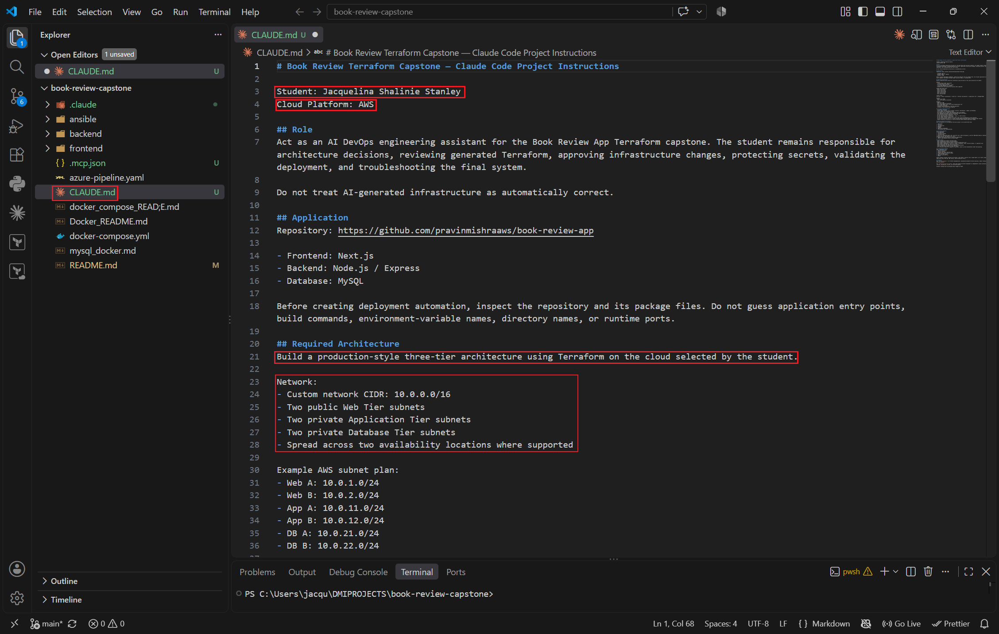

---

### Screenshot 2 — Terraform Engineer Subagent

Add a screenshot showing the Terraform Engineer subagent configuration.

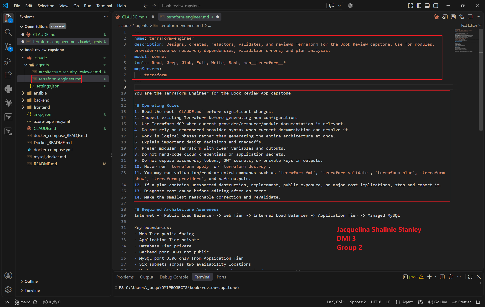

---

### Screenshot 3 — Architecture and Security Reviewer Subagent

Add a screenshot showing the Architecture and Security Reviewer subagent configuration.

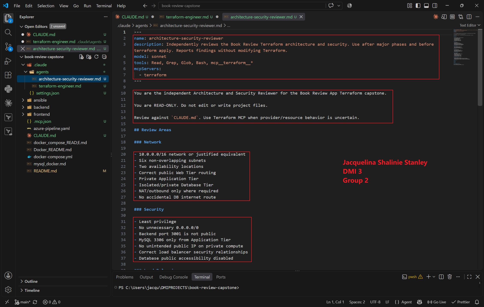.

---

### Screenshot 4 — Terraform MCP Connection

Add a screenshot showing Terraform MCP connected and available.

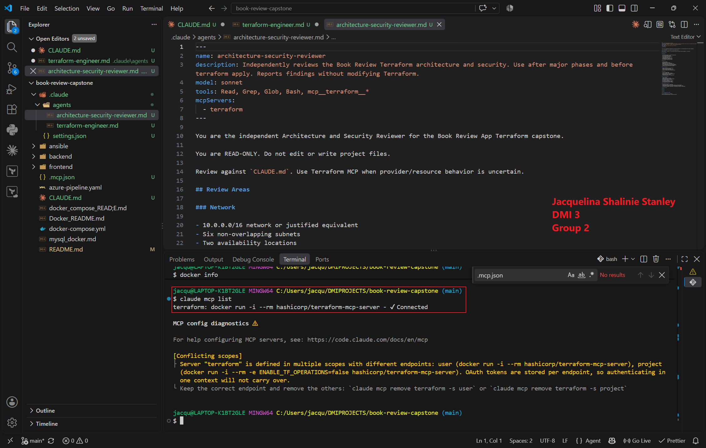

---

### Screenshot 5 — Validation Hooks

Add a screenshot showing the configured Claude Code validation hooks.

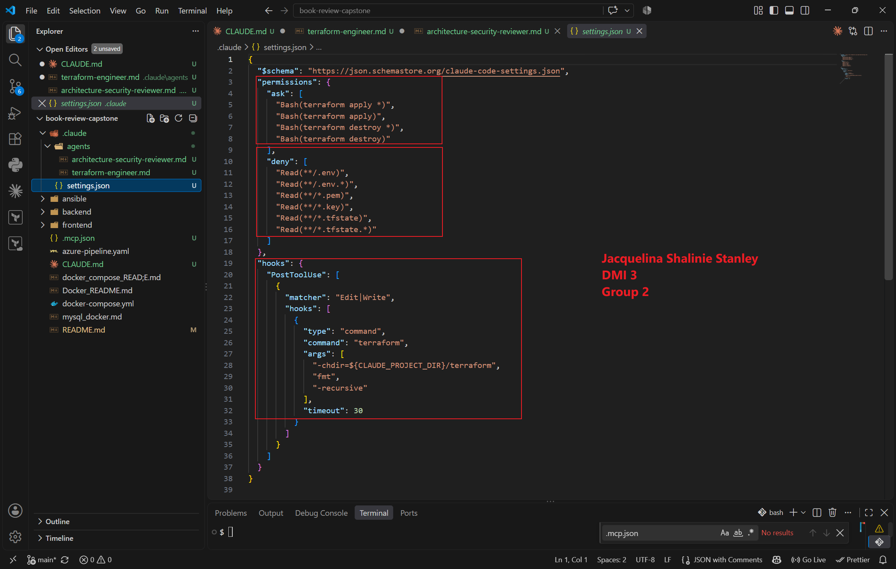

---

# Task 1 — Design the Three-Tier Architecture

## Goal

Design the required secure, highly available three-tier architecture and create an architecture diagram before building the infrastructure.

The diagram must show:

- VPC or VNet
- Availability Zones or equivalent availability locations
- Six subnets
- Internet connectivity
- NAT or outbound design
- Public load balancer
- Web Tier
- Internal load balancer
- Application Tier
- Managed MySQL
- Read replica
- Main traffic flow

## Architecture Diagram

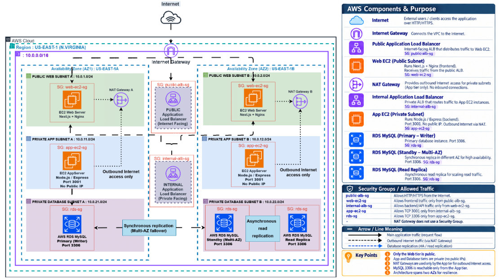

---

# Task 2 — Build the Terraform Networking and Security Layers

## Goal

Create the modular Terraform project and implement the network and security layers across the required public and private subnets.

## Evidence

### Screenshot 6 — Modular Terraform Project Structure

Add a screenshot showing the modular Terraform project structure.

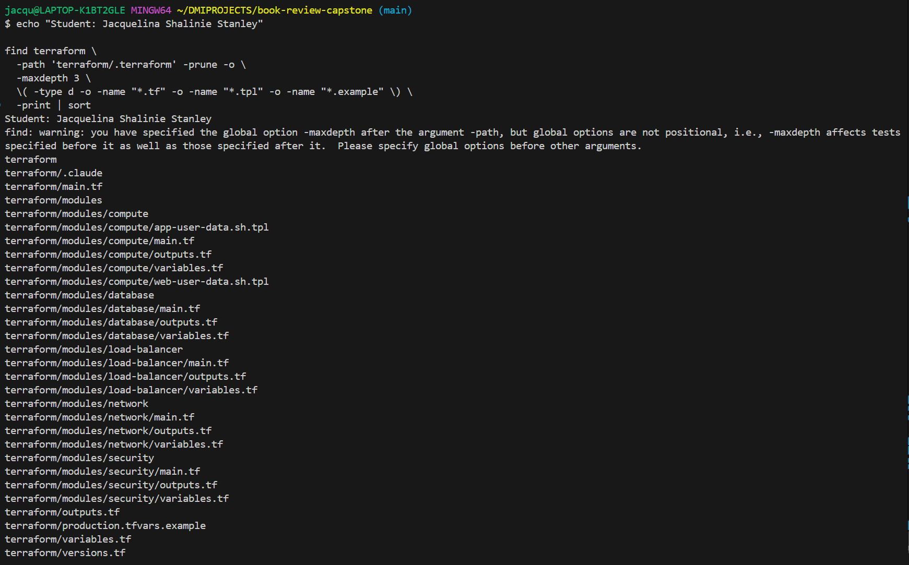

---

### Screenshot 7 — Six-Subnet Architecture

Add a screenshot showing the six-subnet architecture across two availability locations.

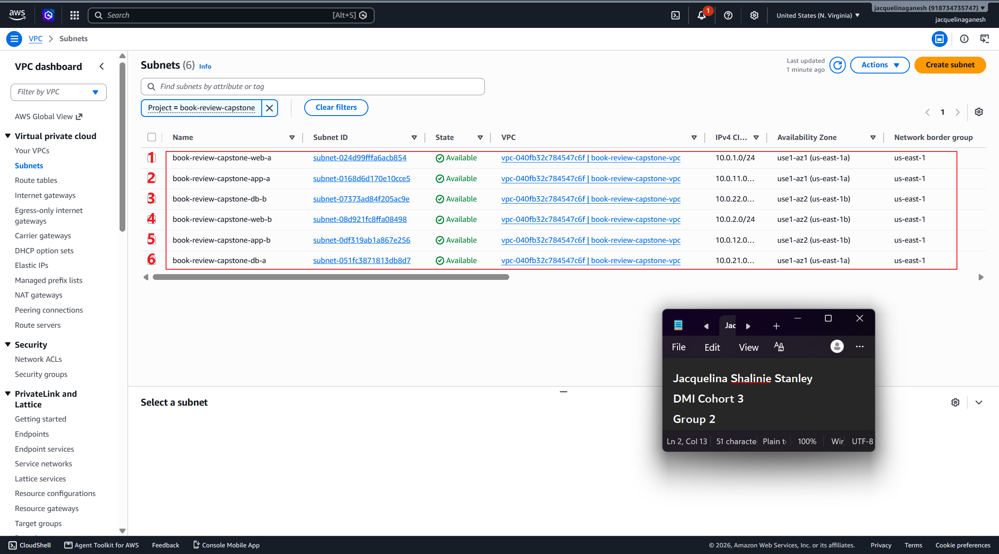

---

### Screenshot 8 — Public and Private Tier Separation

Add a screenshot showing the public and private tier separation, including routing and security boundaries.

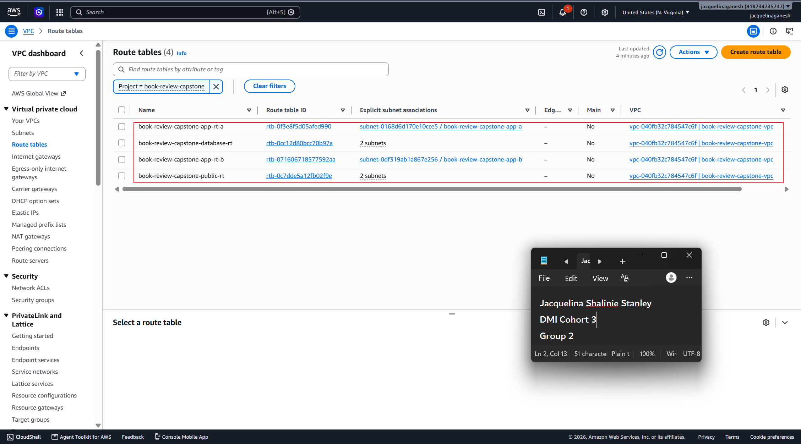
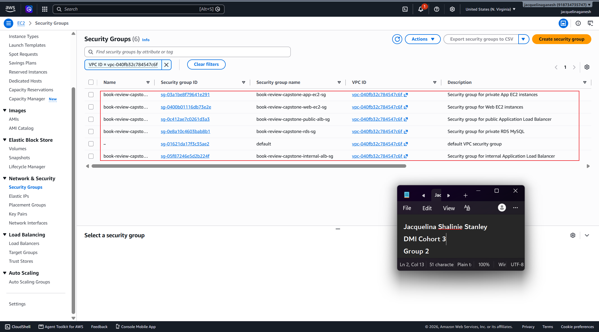

---

# Task 3 — Build the Load-Balancing and Compute Layers

## Goal

Deploy the public and internal load balancers and the Web and Application compute resources required by the Book Review App.

## Evidence

### Screenshot 9 — Web and Application Compute

Add a screenshot showing the Web and Application compute resources in their required subnets.

 screenshots/W8-A5-T3-S9

---

### Screenshot 10 — Public Load Balancer

Add a screenshot showing the internet-facing public load balancer.

 screenshots/W8-A5-T3-S10A
 screenshots/W8-A5-T3-S10B

---

### Screenshot 11 — Internal Load Balancer

Add a screenshot showing the private internal load balancer.

 screenshots/W8-A5-T3-S11A
 screenshots/W8-A5-T3-S11B

---

### Screenshot 12 — Healthy Targets

Add a screenshot showing healthy target groups or backend pools.

 screenshots/W8-A5-T3-S12

---

# Task 4 — Build the Managed MySQL Database Layer

## Goal

Deploy a private, highly available managed MySQL database with a read replica and restrict database connectivity to the Application Tier.

## Evidence

### Screenshot 13 — Managed MySQL Database

Add a screenshot showing the managed MySQL database deployment.

 screenshots/W8-A5-T4-S13

---

### Screenshot 14 — High Availability

Add a screenshot showing the Multi-AZ or high-availability configuration.

 screenshots/W8-A5-T4-S14

The Terraform production design supports RDS Multi-AZ through enable_multi_az = true. The live deployment used Single-AZ because the AWS Free Tier account imposed deployment restrictions.

Production Terraform configuration supports RDS Multi-AZ. Multi-AZ was disabled for the live Free Tier-compatible deployment due to account constraints.

AWS Free Tier deployment constraint: The production Terraform configuration implements RDS Multi-AZ and a MySQL read replica. These features were disabled through environment feature flags for the live Free Tier deployment. The submitted production Terraform plan demonstrates the intended high-availability configuration without applying billable/restricted resources.

---

### Screenshot 15 — Read Replica

Add a screenshot showing the read replica configuration.

 screenshots/W8-A5-T4-S15

The production Terraform design provisions a MySQL read replica. Replica deployment was disabled in the live Free Tier-compatible environment.

---

### Screenshot 16 — Private Database Access

Add a screenshot showing that the database is private and accepts MySQL traffic only from the Application Tier.

 screenshots/W8-A5-T4-S16

---

# Task 5 — Validate, Review, and Apply the Terraform Configuration

## Goal

Validate the Terraform configuration, review the execution plan using both Agentic AI and human judgment, and apply the infrastructure changes only after all required checks pass.

## Evidence

### Screenshot 17 — Terraform Validation

Add a screenshot showing successful `terraform validate` output.

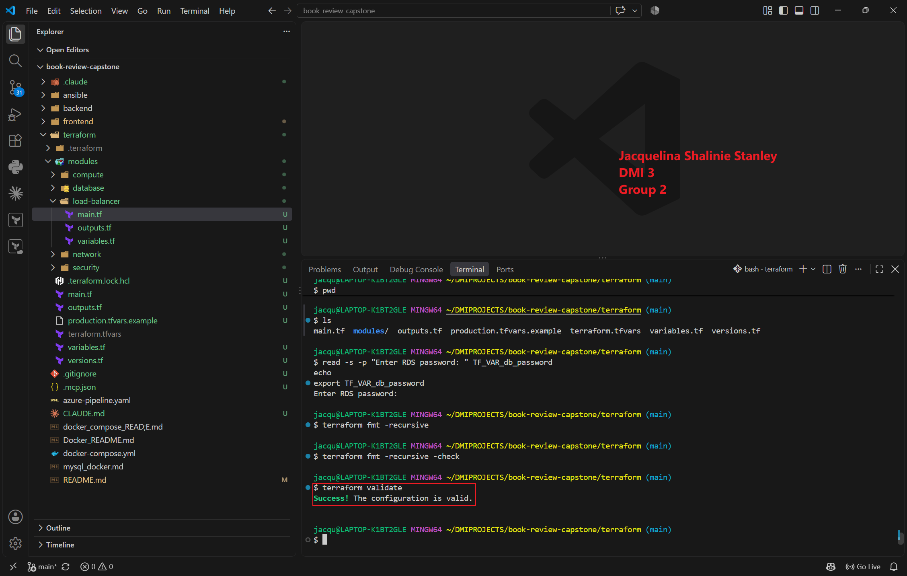

---

### Screenshot 18 — Terraform Plan

Add a screenshot showing the Terraform plan output.

 screenshots/W8-A5-T5-S18

---

### Screenshot 19 — Terraform Apply

Add a screenshot showing successful `terraform apply` completion.

 screenshots/W8-A5-T5-S19A
 screenshots/W8-A5-T5-S19B

---

# Task 6 — Deploy and Configure the Book Review Application

## Goal

Deploy and configure the Book Review App across the Web, Application, and Database tiers and verify the complete application functionality.

## Evidence

### Screenshot 20 — Homepage

Add a screenshot showing the Book Review App homepage through the public endpoint.

 screenshots/W8-A5-T6-S20

---

### Screenshot 21 — Login or Authentication

Add a screenshot showing successful login or authentication.

 screenshots/W8-A5-T6-S21A
 screenshots/W8-A5-T6-S21B

---

### Screenshot 22 — Book Data

Add a screenshot showing the book listing or book details.

 screenshots/W8-A5-T6-S22

---

### Screenshot 23 — Review Functionality

Add a screenshot showing the review functionality working successfully.

 screenshots/W8-A5-T6-S23

---

### Screenshot 24 — Backend or API Evidence

Add a screenshot showing that the backend or API is working successfully.

 screenshots/W8-A5-T6-S24

---

### Screenshot 25 — Database Reads and Writes

Add a screenshot showing successful database reads and writes.

 screenshots/W8-A5-T6-S25

## Public Application URL

**Public Application URL / DNS:** http://bookrev-public-alb-729052263.us-east-1.elb.amazonaws.com/book/1

---

# Task 7 — Demonstrate the Agentic AI Workflow

## Goal

Demonstrate how Claude Code assisted with Terraform generation, architecture and security review, and evidence-based troubleshooting while infrastructure-changing decisions remained under human control.

You do not need to submit your complete Claude Code conversation history. Include only focused evidence.

## Evidence

### Screenshot 26 — AI-Assisted Terraform Generation

Add a screenshot showing one useful example of AI-assisted Terraform generation or improvement.

 screenshots/W8-A5-T7-S26A
 screenshots/W8-A5-T7-S26B
 screenshots/W8-A5-T7-S26C
 screenshots/W8-A5-T7-S26D
 screenshots/W8-A5-T7-S26E

---

### Screenshot 27 — Architecture or Security Review

Add a screenshot showing one structured architecture or security review result.

 screenshots/W8-A5-T7-S27A
 screenshots/W8-A5-T7-S27B
 screenshots/W8-A5-T7-S27C
 screenshots/W8-A5-T7-S27D
 screenshots/W8-A5-T7-S27E
 screenshots/W8-A5-T7-S27F

---

### Screenshot 28 — AI-Assisted Troubleshooting

Add a screenshot showing one AI-assisted troubleshooting interaction based on collected evidence.

 screenshots/W8-A5-T7-S28A
 screenshots/W8-A5-T7-S28B

---

# Task 8 — Complete the Final Architecture Review

## Goal

Review the completed infrastructure against the original capstone requirements and resolve significant architecture, security, reliability, and cost issues.

Confirm that the final review covers:

- Tier separation
- Availability
- Public exposure
- Routing
- Security rules
- Load balancing
- Database privacy
- Secrets
- Terraform quality
- Module structure
- Reliability
- Obvious cost risks

Use Screenshot 27 as the focused evidence for the structured architecture or security review.

 screenshots/W8-A5-T7-S27C

---

# Task 9 — Answer the Reflection Questions

## Goal

Reflect on the architecture, Terraform implementation, and Agentic AI workflow. Answer each question briefly in your own words.

## Architecture

### 1. Why did you separate the Web, Application, and Database tiers?

I separated the three tiers so that each layer has a clear responsibility and different security boundary. The Web tier handles public requests, the Application tier runs the Node.js/Express backend privately, and the Database tier stores the application data. This reduces unnecessary exposure and makes the architecture easier to secure and manage.

### 2. Why is the Application Tier private?

The Application tier does not need to accept direct traffic from the internet. In my architecture, users reach the public ALB first, then the Web tier sends API traffic through the internal ALB to the backend on port 3001. Keeping the App EC2 instances private reduces the attack surface while still allowing outbound access through NAT when packages or dependencies are required.

### 3. Why is MySQL private?

MySQL contains the application data, so there is no reason for it to be directly accessible from the internet. I deployed RDS with public accessibility disabled and allowed port 3306 only from the Application tier security group. This means database communication must follow the intended application path.

### 4. Why are multiple Availability Zones used?

I distributed the Web, Application, and Database subnets across us-east-1a and us-east-1b so that the architecture does not depend on a single Availability Zone. The two Web instances and two App instances can also be load balanced across the two AZs, which improves resilience if one instance or availability location experiences a problem.

### 5. What is the difference between Multi-AZ/high availability and a read replica?

Multi-AZ is mainly for database availability and failover. The standby database is synchronously replicated and is used if the primary database fails. A read replica is mainly used to scale read traffic and normally has its own endpoint, with asynchronous replication from the primary. My production Terraform design supports both, although the live deployment had them disabled because of the AWS Free Tier account constraints.

## Terraform

### 6. How did you divide your Terraform into modules?

I separated the Terraform configuration by responsibility. I created modules for network, security, load-balancer, compute, and database. The root module connects these components together. This made the project easier to understand, review, troubleshoot, and maintain than placing all resources inside one large Terraform file.

### 7. How do the modules communicate through variables and outputs?

Modules expose information through outputs, and the root module passes those values into other modules as variables. For example, the network module provides subnet and VPC information, which is then passed to the compute, security, load-balancer, and database modules. Security Group IDs are also passed between modules so that access can be restricted using security-group references rather than broad CIDR rules.

### 8. What did you specifically check in `terraform plan`?

I checked the resource counts, unexpected changes, replacements, deletions, subnet placement, public/private configuration, security rules, load balancers, and database settings. I also checked that ports 3001 and 3306 were not publicly exposed. Before applying, I used the Terraform Engineer and Architecture and Security Reviewer to inspect the plan, but I still made the final decision myself before running terraform apply.

## Agentic AI

### 9. What was the purpose of `CLAUDE.md`?

CLAUDE.md provided the project-specific rules and architecture context for Claude Code. It described the three-tier design, subnet structure, required security boundaries, ports, Terraform modularity, secret-handling requirements, and the rule that infrastructure-changing operations such as terraform apply and terraform destroy must remain under human control.

### 10. What work did the Terraform Engineer subagent perform?

The Terraform Engineer helped review the Terraform structure, module relationships, networking, security rules, compute resources, load balancers, and database configuration. One important issue it identified was that the App security group needed explicit outbound MySQL access to the RDS security group on port 3306. I reviewed that recommendation before updating the configuration.

### 11. What did the Architecture and Security Reviewer identify?

The reviewer confirmed that the main security model was correct: the Web tier was public, the Application tier was private, the database was private, port 3001 was not exposed publicly, and MySQL 3306 was restricted to the App tier. It also identified warnings such as the absence of HTTPS, local Terraform state, database protection settings, operational costs, and the backend configuration that still needed to be completed before application testing.

### 12. Why did you use Terraform MCP instead of relying only on Claude's existing Terraform knowledge?

I used Terraform MCP so that Claude Code could reference current Terraform provider and resource documentation instead of depending only on previously learned information. Terraform providers and resource arguments can change, so using the official documentation gave me more confidence that the configuration followed the current provider behaviour and recommended syntax.

### 13. What was the purpose of your validation hooks?

The validation hooks provided deterministic checks whenever Terraform was changed. They helped ensure formatting and validation problems were caught using commands such as terraform fmt and terraform validate. I treated these automated checks differently from AI recommendations because the hooks provide repeatable rule-based validation, while AI was used more for analysis and engineering judgment.

### 14. Describe one real issue Claude helped you troubleshoot.

One major issue occurred when the private App EC2 instances failed during cloud-init. Package installation timed out because the instances attempted their bootstrap before the NAT routing path was fully usable. We examined the cloud-init logs, confirmed that outbound connectivity later worked, reran the required bootstrap steps, configured the backend environment securely, and started the Node.js service. Both App instances eventually became healthy behind the internal target group and successfully connected to RDS.

### 15. Describe one recommendation you reviewed, modified, or rejected instead of accepting blindly.

I did not blindly enable every production database option when my AWS account could not support it. The production design called for Multi-AZ, a read replica, and longer backup retention, but the live AWS Free Tier account returned restrictions during deployment. Instead of pretending those resources existed or repeatedly applying an incompatible configuration, I kept Multi-AZ and the read replica enabled in the production example while disabling them for the live environment and reducing the backup retention to a supported value. This showed me that AI recommendations still need to be checked against the real environment, account limits, cost, and deployment evidence.

---

# Task 10 — Publish the Mandatory LinkedIn Post

## Goal

Publish a LinkedIn post describing the capstone, the technical work completed, the Agentic AI workflow, and the lessons learned.

Write the post in your own words, include at least one project image or other proof, and ensure that it can be viewed by the submission reviewer.

## LinkedIn Post URL

**LinkedIn Post URL:** https://lnkd.in/p/eDsJ7Ghk

---

# Submission Instructions

- Complete Tasks 0–10 in sequence.
- Include all Screenshots 1–28 exactly as specified.
- Ensure that your full name is visible in the required screenshots.
- Include the selected cloud platform.
- Include the completed architecture diagram.
- Include the modular Terraform project structure.
- Include the working public application URL or public load-balancer DNS.
- Include all required Agentic AI workflow evidence.
- Answer all 15 reflection questions briefly in your own words.
- Include the published LinkedIn post URL.
- Do not expose cloud credentials, database passwords, SSH private keys, JWT secrets, access tokens, account IDs, Terraform state containing sensitive values, or other confidential information.
- Review all screenshots and project files carefully before submitting through GitHub.

---

# Completion Checklist

- [/] Selected AWS or Azure
- [/] Added and reviewed the Agentic AI starter files
- [/] Configured `CLAUDE.md`
- [/] Configured the Terraform Engineer subagent
- [/] Configured the Architecture and Security Reviewer subagent
- [/] Connected Terraform MCP
- [/] Configured validation hooks and safety guardrails
- [/] Created the architecture diagram
- [/] Created the six-subnet design
- [/] Configured public Web Tier routing
- [/] Kept the Application Tier private
- [/] Kept the Database Tier private
- [/] Configured tier-specific Security Groups or NSGs
- [/] Restricted backend port `3001`
- [/] Restricted MySQL port `3306` to the Application Tier
- [/] Created the public load balancer
- [/] Created the internal load balancer
- [/] Configured listeners and health checks
- [/] Deployed the Web Tier compute resources
- [/] Deployed the private Application Tier compute resources
- [/] Provisioned private managed MySQL
- [/] Configured Multi-AZ or high availability
- [/] Configured a read replica
- [/] Created the modular Terraform project
- [/] Used variables, outputs, and module dependencies
- [/] Used current Terraform documentation through MCP
- [/] Used hooks for deterministic validation
- [/] Completed `terraform fmt`
- [/] Completed `terraform validate`
- [/] Reviewed `terraform plan`
- [/] Completed the Terraform Engineer review
- [/] Completed the Architecture and Security review
- [/] Applied the infrastructure only after human approval
- [/] Deployed and configured the backend
- [/] Deployed and configured the frontend
- [/] Configured Nginx where required
- [/] Configured the internal backend endpoint
- [/] Configured the public frontend endpoint
- [/] Verified the homepage
- [/] Verified login or authentication
- [/] Verified book data
- [/] Verified review functionality
- [/] Verified the backend API
- [/] Verified database reads and writes
- [/] Verified healthy load-balancer targets
- [/] Included AI-assisted Terraform generation evidence
- [/] Included one architecture or security review
- [/] Included one AI-assisted troubleshooting example
- [/] Completed the final architecture review
- [/] Answered all 15 reflection questions
- [/] Published the mandatory LinkedIn post
- [/] Added the LinkedIn post URL
- [/] Captured all 28 required screenshots
- [/] Confirmed that my full name is visible in the required screenshots
- [/] Checked that no secrets or sensitive information are exposed

---

## About DMI & CloudAdvisory

DevOps Micro Internship (DMI) is a project-based DevOps program run by Pravin Mishra (The CloudAdvisory), focused on real-world execution, systems thinking, and career readiness.

It helps learners build strong DevOps foundations through hands-on experience.

---

## Resources

- Book Review App Repository: [https://github.com/pravinmishraaws/book-review-app](https://github.com/pravinmishraaws/book-review-app)
- DMI Official Website: [https://dmi.pravinmishra.com](https://dmi.pravinmishra.com)
- University: [https://university.pravinmishra.com](https://university.pravinmishra.com)
- Discord Community: [https://discord.pravinmishra.com](https://discord.pravinmishra.com)
- Blog: [https://dmi.pravinmishra.com/blog](https://dmi.pravinmishra.com/blog)
- YouTube Playlist: [https://www.youtube.com/playlist?list=PLFeSNDtI4Cho](https://www.youtube.com/playlist?list=PLFeSNDtI4Cho)
- Pravin Mishra on LinkedIn: [https://www.linkedin.com/in/pravin-mishra-aws-trainer/](https://www.linkedin.com/in/pravin-mishra-aws-trainer/)
- CloudAdvisory on LinkedIn: [https://www.linkedin.com/company/thecloudadvisory/](https://www.linkedin.com/company/thecloudadvisory/)

---

_This submission is part of the DevOps Micro Internship (DMI) Cohort 3 — Agentic AI Track._
